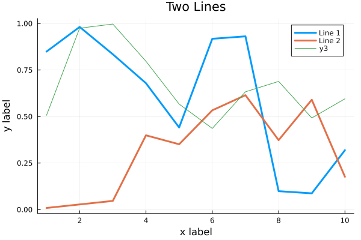

.. _dataframes-dataformats:

Data Formats and Dataframes
===========================

.. questions:: 

   - How can I manipulate and wrangle dataframes in Julia?
   - How can I handle missing data in a DataFrame in Julia?
   - How can I merge data in Julia?
   - How can I use the Fourier transform to analyze climate data in Julia?
     
.. instructor-note:: Instructor-note

   - 35 min teaching
   - 30 min exercises

Working with data
-----------------

We will now explore a Julian approach to a use case common to 
many scientific disciplines: manipulating data and visualization.
Julia is a good language to use for data science problems as
it will perform well and alleviate the need to translate
computationally demanding parts to another language.

Here we will learn how to work with data using 
the DataFrames package, visualize it with the Plots and StatsPlots.

DataFrame in Julia
^^^^^^^^^^^^^^^^^^

In Julia, a DataFrame is a two-dimensional table-like data structure,
similar to a Excel spreadsheet or a SQL table.
It is part of the DataFrames.jl package, which provides a powerful 
and flexible way to manipulate and analyze data in Julia.  

A DataFrame consists of columns and rows. 

.. figure:: img/01_table_dataframe.svg
   :align: center

The rows usually represent independent observations, while the columns represent the 
features (variables) for each observation.
You can perform various operations on a DataFrame, such as filtering, 
sorting, grouping, joining, and aggregating data.

The `DataFrames.jl <https://dataframes.juliadata.org/stable/>`_ 
package offers similar functionality as the ``pandas`` library in Python and 
the ``data.frame()`` function in R.
``DataFrames.jl`` also provides a rich set of functions for data cleaning, 
transformation, and visualization, making it a popular choice for 
data science and machine learning tasks in Julia. Just like in Python and R, 
the ``DataFrames.jl`` package provides functionality for data manipulation and analysis. 

Download a dataset
^^^^^^^^^^^^^^^^^^

We start by downloading a dataset containing measurements 
of characteristic features of different penguin species.

.. figure:: img/lter_penguins.png
   :align: center

   Artwork by @allison_horst

The dataset is bundled within the ``PalmerPenguins`` package, so we need to add that:

.. code-block:: julia

   Pkg.add("PalmerPenguins")
   using PalmerPenguins

We will use DataFrames here to analyze the penguins dataset, but first we need to install it:

.. code-block:: julia

   Pkg.add("DataFrames")
   using DataFrames

Here's how you can create a new dataframe:

 .. code-block:: julia

   using DataFrames
   names = ["Ali", "Clara", "Jingfei", "Stefan"]
   age = ["25", "39", "14", "45"]
   df = DataFrame(name=names, age=age)

 .. code-block:: julia-repl

    4×2 DataFrame
    Row │ name        age
        │ String      String 
    ────┼────────────────────
      1 │ Ali         25
      2 │ Clara       39
      3 │ Jingfei     14
      4 │ Stefan      45

.. todo:: Dataframes
   
   The following code loads the ``PalmerPenguins`` dataset into a DataFrame. 

   .. code-block:: julia

      using DataFrames
      #Load the PalmerPenguins dataset
      table = PalmerPenguins.load()
      df = DataFrame(table)

   Data can be saved in several common formats such as CSV, JSON, and
   Parquet using the ``CSV``, ``JSONTables``, and ``Parquet`` packages respectively. 

   An overview of common data formats for different use cases can be found 
   `here <https://enccs.github.io/hpda-python/scientific-data/#an-overview-of-common-data-formats>`__.

   .. tabs::

      .. tab:: CSV

         .. code-block:: julia

            using CSV
            CSV.write("penguins.csv", df)
            df = CSV.read("penguins.csv", DataFrame)

      .. tab:: JSON

         .. code-block:: julia

            using JSONTables
            using JSON3
            open("penguins.json", "w") do io
               write(io, JSONTables.objecttable(df))
            end
            df = DataFrame(JSON3.read("penguins.json"))

      .. tab:: Parquet

         .. code-block:: julia

            using Parquet
            Parquet.write("penguins.parquet", df)
            df = Parquet.read("penguins.parquet", DataFrame)
   
   We now create a dataframe containing the PalmerPenguins dataset.
   Note that the ``table`` variable is of type ``CSV.File``; the 
   PalmerPenguins package uses the `CSV.jl <https://csv.juliadata.org/stable/>`_ 
   package for fast loading of data. Note further that ``DataFrame`` can 
   accept a ``CSV.File`` object and read it into a dataframe!
   
   .. code-block:: julia
   
      using PalmerPenguins
      table = PalmerPenguins.load()
      df = DataFrame(table)
   
      # the raw data can be loaded by
      #tableraw = PalmerPenguins.load(; raw = true)
   
      first(df, 5)
   
   .. code-block:: text
   
      344×7 DataFrame
       Row │ species    island     bill_length_mm  bill_depth_mm  flipper_length_mm  body_mass_g  sex     
           │ String     String     Float64?        Float64?       Int64?             Int64?       String? 
      ─────┼──────────────────────────────────────────────────────────────────────────────────────────────
         1 │ Adelie   Torgersen            39.1           18.7                181         3750  male
         2 │ Adelie   Torgersen            39.5           17.4                186         3800  female
         3 │ Adelie   Torgersen            40.3           18.0                195         3250  female
         4 │ Adelie   Torgersen       missing        missing              missing      missing  missing 
         5 │ Adelie   Torgersen            36.7           19.3                193         3450  female
   

Inspect dataset
^^^^^^^^^^^^^^^
.. todo::
      
   We can inspect the data using a few basic operations:
   
   .. code-block:: julia
   
      # slicing
      df[1, 1:3]
   
      # slicing and column name (can also use "island")
      df[1:20:100, :island]
   
      # dot syntax (editing will change the dataframe)
      df.species
   
      # get a copy of a column 
      df[:, [:sex, :body_mass_g]]
   
      # access column directly without copying (editing will change the dataframe)
      df[!, :bill_length_mm]
   
      # get size
      size(df), ncol(df), nrow(df)
   
      # find unique species
      unique(df.species)
   
   
   Summary statistics can be displayed with the ``describe`` function:
   
   .. code-block:: julia
   
      describe(df)
   
   .. code-block:: text
   
      7×7 DataFrame
       Row │ variable           mean     min     median  max        nmissing  eltype                  
           │ Symbol             Union…   Any     Union…  Any        Int64     Type                    
      ─────┼──────────────────────────────────────────────────────────────────────────────────────────
         1 │ species                     Adelie          Gentoo            0  String
         2 │ island                      Biscoe          Torgersen         0  String
         3 │ bill_length_mm     43.9219  32.1    44.45   59.6              2  Union{Missing, Float64}
         4 │ bill_depth_mm      17.1512  13.1    17.3    21.5              2  Union{Missing, Float64}
         5 │ flipper_length_mm  200.915  172     197.0   231               2  Union{Missing, Int64}
         6 │ body_mass_g        4201.75  2700    4050.0  6300              2  Union{Missing, Int64}
         7 │ sex                         female          male             11  Union{Missing, String}

   We can see in the output of ``describe`` that the element type of 
   all the columns is a union of ``missing`` and a numeric type. This
   implies that our dataset contains missing values.
   More about `Tidy Data` concept can be found in the `Python for Scientific Computing` training by `Aalto Scientific Computing <https://scicomp.aalto.fi/>`_: https://aaltoscicomp.github.io/python-for-scicomp/pandas/#tidy-data
   
   We can remove these missing values by the ``dropmissing`` or ``dropmissing!`` functions
   (what is the difference between them?):
   
   .. code-block:: julia
   
      dropmissing!(df)

   Alternatively, we can use:

   .. code-block:: julia
      
      # Missing data
      # Replacing missing values with a specific value
      df = coalesce.(df, 0)

   The code shows how to handle missing data in the `bill_length_mm` column by replacing missing
   values with a specific value using the `coalesce` function or by interpolating missing values
   using the `Interpolations` package.

   .. code-block:: julia

      # Interpolating missing values
      using Interpolations
      mask = ismissing.(df[:bill_length_mm])
      itp = interpolate(df[:bill_length_mm][.!mask], BSpline(Linear()))
      df[:bill_length_mm][mask] .= itp.(findall(mask))

   It throws the issue because the syntax df[column] is not supported in Julia 1.9.0.
   Here is the correct code:

   .. code-block:: julia

      # Interpolating missing values
      using Interpolations
      mask = ismissing.(df.bill_length_mm)
      itp = interpolate(df[!, :bill_length_mm][.!mask], BSpline(Linear()))
      df[!, :bill_length_mm][mask] .= itp.(findall(mask))   

   `mask = ismissing.(df.bill_length_mm)`: This line is creating a logical mask that is `true` wherever there are missing values (`NaN`) in the `bill_length_mm` column and `false` elsewhere.

   `itp = interpolate(df[!, :bill_length_mm][.!mask], BSpline(Linear()))`: This line is creating an interpolation object `itp`. It's using only the non-missing values of the `bill_length_mm` column (specified by `df[!, :bill_length_mm][.!mask]`) and a linear B-spline interpolation method (`BSpline(Linear())`).
   
   `df[!, :bill_length_mm][mask] .= itp.(findall(mask))`: This line is replacing the missing values in the `bill_length_mm` column with the interpolated values. It's finding the indices of the missing values with `findall(mask)` and then using the interpolation object `itp` to estimate values at these indices.

So, in summary, this code is filling in missing values in the `bill_length_mm` column by estimating their value based on a linear interpolation of the non-missing values. This can be a useful way to handle missing data when you don't want to or can't simply ignore those missing values. 😊

(Optional) Long vs Wide Data Format
^^^^^^^^^^^^^^^^^^^^^^^^^^^^^^^^^^^

The data is in a so-called `wide format <https://en.wikipedia.org/wiki/Wide_and_narrow_data>`_.

In data analysis, we often encounter two types of data formats: **long format** and **wide format**.
https://www.statology.org/long-vs-wide-data/

- **Long format**: In this format, each row is a single observation, and each column is a variable. This format is also known as "tidy" data.
- **Wide format**: In this format, each row is a subject, and each column is an observation. This format is also known as "spread" data.

The `DataFrames.jl` package provides functions to reshape data between long and wide formats. These functions are `stack`, `unstack`, `melt`, and `pivot`.
Detailed tutorial: https://dataframes.juliadata.org/stable/man/reshaping_and_pivoting/ 

.. code-block:: julia

   # To convert from wide to long format
   df_long = stack(df, Not(:species))

   # To convert from long to wide format
   df_wide = unstack(df_long, :species, :variable, :value)
   
   # or
   # Custom combine function
   function custom_combine(x)
      if eltype(x) <: Number
         return mean(skipmissing(x))
      else
         return first(skipmissing(x))
      end
   end

   # Unstack DataFrame with custom combine function
   df_wide = unstack(df_long, :species, :variable, :value, combine = custom_combine)

(Optional) Reshaping and Pivoting
^^^^^^^^^^^^^^^^^^^^^^^^^^^^^^^^^

The `pivot` function can be used to reshape data (from long to wide format) and also perform aggregation.

.. code-block:: julia

   using Statistics

   # Pivot data with aggregation
   df_grouped = groupby(df, [:species, :island])
   df_pivot = combine(df_grouped, :body_mass_g => mean)

In this example, `groupby(df, [:species, :island])` groups your DataFrame by the `species` and `island` columns.
Then, `combine(df_grouped, :body_mass_g => mean)` calculates the mean of the `body_mass_g` column for each group.
The `mean` function is used for aggregation.

The result is a new DataFrame where each unique value in the `:species` column forms a row, each unique 
value in the `:island` column forms a column, and the mean body mass for each species-island combination fills the DataFrame.

Note that if you don't provide an aggregation function and there are multiple values for a given row-column combination, 
`pivot` will throw an error. To handle this, you can provide an aggregation function like `mean`, `sum`, etc., 
which will be applied to all values that fall into each cell of the resulting DataFrame.

Creating and merging DataFrames like in SQL
^^^^^^^^^^^^^^^^^^^^^^^^^^^^^^^^^^^^^^^^^^^

Creating DataFrames

In Julia, you can create a DataFrame from scratch using the `DataFrame` constructor from the `DataFrames` package.
This constructor allows you to create a DataFrame by passing column vectors as keyword arguments or pairs.
For example, to create a DataFrame with two columns named `:A` and `:B`, you can use the following code: 
`DataFrame(A = 1:3, B = ["x", "y", "z"])`
You can also create a DataFrame from other data structures such as dictionaries, named tuples, vectors of vectors, matrices, and more.
You can find more information about creating DataFrames in Julia in the `official documentation <https://dataframes.juliadata.org/stable/man/getting_started/>`_

Merging DataFrames

Also, you can merge two or more DataFrames using the `join` function from the `DataFrames` package.
This function allows you to perform various types of joins, such as inner join, left join, right join, outer join, semi join, and anti join. 
You can specify the columns used to determine which rows should be combined during a join by passing them as the `on` argument to the `join` function.
For example, to perform an inner join on two DataFrames `df1` and `df2` using the `:ID` column as the key, you can use the following code: `join(df1, df2, on = :ID, kind = :inner)`.
You can find more information about joining DataFrames in Julia in the `official documentation <https://dataframes.juliadata.org/stable/man/joins/>`_ 

Plotting
^^^^^^^^

Let us now look at different ways to visualize this data.
Many different plotting libraries exist for Julia and which 
one to use will depend on the specific use case as well as 
personal preference. 

.. topic:: Some plotting packages in Julia
      
   - `Plots.jl <http://docs.juliaplots.org/latest/>`_: high-level 
     API for working with several different plotting back-ends, including `GR`, 
     `Matplotlib.Pyplot`, `Plotly` and `PlotlyJS`.
   - `StatsPlots.jl <https://github.com/JuliaPlots/StatsPlots.jl>`_: was moved 
     out from core `Plots.jl`. Focuses on statistical use-cases and supports 
     specialized statistical plotting functionalities.
   - `GadFly.jl <http://gadflyjl.org/stable/>`_: based largely on 
     `ggplot2 for R <https://ggplot2.tidyverse.org/>`_ and the book 
     `The Grammar of Graphics <https://www.cs.uic.edu/~wilkinson/TheGrammarOfGraphics/GOG.html>`_.
     Well suited for statistics and machine learning.
   - `VegaLite.jl <https://www.queryverse.org/VegaLite.jl/stable/>`_: based on 
     `Vega-Lite <https://vega.github.io/vega-lite/>`_, a grammar of interactive graphics. 
     Great for interactive graphics.
   - `Makie.jl <https://makie.juliaplots.org/stable/>`_ data visualization ecosystem with backends 
     `GLMakie.jl` (OpenCL), `CairoMakie.jl` (Cairo) and `WGLMakie.jl` (WebGL). 
     Good for publication-quality plotting but can be a bit slow to load and use.

We will be using `Plots.jl` and `StatsPlots.jl` but we encourage to explore these 
other packages to find the one that best fits your use case.

First we install `Plots.jl` and `StatsPlots` backend:

.. code-block:: julia

   Pkg.add("Plots")
   Pkg.add("StatsPlots")   

Here's how a simple line plot works:

.. code-block:: julia

   using Plots 
   gr()  # set the backend to GR

   x = 1:10; y = rand(10, 2) 
   plot(x, y, title = "Two Lines", label = ["Line 1" "Line 2"], lw = 3) 

In VSCode, the plot should appear in a new plot pane.  
We can add labels:

.. code-block:: julia

   xlabel!("x label")
   ylabel!("y label")

To add a line to an existing plot, we mutate it with ``plot!``:

.. code-block:: julia

   z = rand(10)
   plot!(x, z)

Finally we can save to the plot to a file:

.. code-block:: julia

   savefig("myplot.png")

   myplot.png

Multiple subplots can be created by:

.. code-block:: julia

   y = rand(10, 4)

   p1 = plot(x, y); # Make a line plot
   p2 = scatter(x, y); # Make a scatter plot
   p3 = plot(x, y, xlabel = "This one is labelled", lw = 3, title = "Subtitle");
   p4 = histogram(x, y); # Four histograms each with 10 points? Why not!
   plot(p1, p2, p3, p4, layout = (2, 2), legend = false)

.. todo:: Visualizing the Penguin dataset

   First load ``Plots`` and set the backend to GR (precompilation of Plots 
   might take some time):

   .. code-block:: julia

      using Plots
      gr()

   For the Penguin dataset it is more appropriate to use scatter plots, for example:

   .. code-block:: julia

      scatter(df[!, :bill_length_mm], df[!, :bill_depth_mm])

   We can adjust the markers by `this list of named colors <https://juliagraphics.github.io/Colors.jl/stable/namedcolors/>`_
   and `this list of marker types <https://docs.juliaplots.org/latest/generated/unicodeplots/#unicodeplots-ref13>`_:

   .. code-block:: julia

      scatter(df[!, :bill_length_mm], df[!, :bill_depth_mm], marker = :hexagon, color = :magenta)

   We can also change the plot theme according to `this list of themes <https://docs.juliaplots.org/latest/generated/plotthemes/>`_, 
   for example:

   .. code-block::

      theme(:dark)
      # then re-execute the scatter function

   We can add a dimension to the plot by grouping by another column. Let's see if 
   the different penguin species can be distiguished based on their bill length 
   and bill depth. We also set different marker shapes and colors based on the 
   grouping, and adjust the markersize and transparency (``alpha``):

   .. code-block:: julia

      scatter(df[!, :bill_length_mm],
              df[!, :bill_depth_mm], 
              xlabel = "bill length (mm)",
              ylabel = "bill depth (g)",
              group = df[!, :species],
              marker = [:circle :ltriangle :star5],
              color = [:magenta :springgreen :blue],
              markersize = 5,
              alpha = 0.8
              )

   .. figure:: img/penguin_scatter.png
      :align: center
      :scale: 50%

   The ``scatter`` function comes from the base `Plots` package. `StatsPlots` provides
   many other types of plot types, for example ``density``. To use dataframes with `StatsPlots`
   we need to use the ``@df`` macro which allows passing columns as symbols (this can also be used 
   for ``scatter`` and other plot functions):

   .. code-block:: julia

      using StatsPlots        

      @df df density(:flipper_length_mm,
                     xlabel = "flipper length (mm)",
                     group = :species,
                     color = [:magenta :springgreen :blue],
                     )

   .. figure:: img/penguin_density.png
      :align: center
      :scale: 50%

Exercises
---------

.. todo:: Create a custom plotting function

   Convert the final ``scatter`` plot in the type-along section "Visualizing the Penguin dataset"
   and convert it into a ``create_scatterplot`` function: 
   
   - The function should take as arguments a dataframe and two column symbols. 
   - Use the ``minimum()`` and ``maximum()`` functions to automatically set the x-range of the plot 
     using the ``xlim = (xmin, xmax)`` argument to ``scatter()``.
   - If you have time, try grouping the data by ``:island`` or ``:sex`` instead of ``:species`` 
     (keep in mind that you may need to adjust the number of marker symbols and colors).
   - If you have more time, play around with the plot appearance using ``theme()`` and the marker symbols and colors.

   .. solution::

      .. code-block:: julia

         function create_scatterplot(df, col1, col2, groupby)
             xmin, xmax = minimum(df[:, col1]), maximum(df[:, col1])
             # markers and colors to use for the groups
             markers = [:circle :ltriangle :star5 :rect :diamond :hexagon]
             colors = [:magenta :springgreen :blue :coral2 :gold3 :purple]
             # number of unique groups can't be larger than the number of colors/markers
             ngroups = length(unique(df[:, groupby]))
             @assert ngroups <= length(colors)
         
             scatter(df[!, col1],
                     df[!, col2],
                     xlabel = col1,
                     ylabel = col2,
                     xlim = (xmin, xmax),
                     group = df[!, groupby],
                     marker = markers[:, 1:ngroups],
                     color = colors[:, 1:ngroups],
                     markersize = 5,
                     alpha = 0.8
                     )
         end    

         create_scatterplot(df, :bill_length_mm, :body_mass_g, :sex)
         create_scatterplot(df, :flipper_length_mm, :body_mass_g, :island)  

.. _DDCexercise:

.. todo:: Working with DataFrames in Julia

   In this exercise, you will practice reading data from CSV files into DataFrames,
   manipulating data in DataFrames, and visualizing data using a plotting package.

   1. Install the `CSV` and `DataFrames` packages by running the following commands in the Julia REPL:

      .. code-block:: julia

         using Pkg
         Pkg.add("CSV")
         Pkg.add("DataFrames")

   2. Set the relative path to the `DailyDelhiClimateTest.csv` and `DailyDelhiClimateTrain.csv` 
   files in the `path_test` and `path_train` variables. Assume that the path to your files is 
   `juliaforhpda/data` and you are currently in the `juliaforhpda/` directory in the Julia REPL.
   The data is available here: https://github.com/ENCCS/julia-for-hpda/blob/main/content/data/DailyDelhiClimateTest.csv 
   and https://github.com/ENCCS/julia-for-hpda/blob/main/content/data/DailyDelhiClimateTrain.csv
   
   This climate data set contains daily mean temperature, humidity, wind speed and mean pressure at a location in Dehli India over a period of several years.
   The data set was downloaded from `here <https://www.kaggle.com/datasets/sumanthvrao/daily-climate-time-series-data/>`__.

   3. Read the data from the CSV files into DataFrames named `df_test` and `df_train` using the `CSV.read` function.

   4. Use the functions provided by the `DataFrames` package to manipulate the data in the DataFrames. For example, you can select columns, filter rows, group data, compute summary statistics, and compute aggregate functions.

   5. Install a plotting package such as `Plots` or `Gadfly` by running the following command in the Julia REPL:

      .. code-block:: julia

         using Pkg
         Pkg.add("Plots")

   6. Use the plotting package to create a line plot of the mean of the `meantemp` column for each group in a grouped DataFrame. Customize the appearance of the plot by changing its properties such as color, line style, marker style, etc.

   .. solution::

      Here is one possible solution to this exercise:

      Once you have read the data from the CSV files into DataFrames, you can 
      manipulate the data using the functions provided by the `DataFrames` package. 
      Here are some examples that show how to manipulate data in a DataFrame:

         .. code-block:: julia

            using CSV

            # Set relative path to CSV files
            path_test = "data/DailyDelhiClimateTest.csv"
            path_train = "data/DailyDelhiClimateTrain.csv"

            # Read data from CSV files into DataFrames
            df_test = CSV.read(path_test, DataFrame)
            df_train = CSV.read(path_train, DataFrame)

            using DataFrames

            # Select columns
            df_test_selected = select(df_test, :meantemp, :humidity)

            # Filter rows
            df_test_filtered = filter(:meantemp => x -> x > 20, df_test)

            # Group data
            df_test_grouped = groupby(df_test, :date)

            # Compute summary statistics
            describe(df_test)

            # Compute aggregate functions
            combine(df_test_grouped, :meantemp => mean)

      This code shows how to select columns, filter rows, group data, compute summary statistics,
      and compute aggregate functions on a DataFrame named `df_test`.
      You can use these and other functions provided by the `DataFrames` package to manipulate the data in the DataFrame.

      .. code-block:: julia

         julia> combine(df_test_grouped, :meantemp => mean)
         ERROR: UndefVarError: `mean` not defined
         Stacktrace:
         [1] top-level scope
            @ REPL[39]:1

      The `mean` function is part of the `Statistics` standard library module in Julia.
      To use the `mean` function, you need to load the `Statistics` module by running `using Statistics`.
      Here is an example that shows how to compute the mean of the `meantemp` column for each group in a grouped DataFrame:

      .. code-block:: julia

         using Statistics

         # Compute mean of meantemp column for each group
         combine(df_test_grouped, :meantemp => mean)

      This code loads the `Statistics` module and uses the `mean` function to compute the mean of the `meantemp`
      column for each group in a grouped DataFrame named `df_test_grouped`. 

      What can we do with this mean, maybe vizualize?

      Yes, you can visualize the mean of the `meantemp` column for each group in a grouped DataFrame
      using a plotting package such as `Plots` or `Gadfly`.

      Here is an example that shows how to create a bar plot of the mean `meantemp` values for each group using the `Plots` package:

      .. code-block:: julia

         using Plots
    
         # Compute mean of meantemp column for each group
         df_test_mean = combine(df_test_grouped, :meantemp => mean)
         
         # Create bar plot of mean meantemp values for each group
         p = bar(df_test_mean.date, df_test_mean.meantemp_mean, xlabel="Date", ylabel="Mean Temperature", label="Mean Temperature")

         # Display plot
         display(p)

      This code computes the mean of the `meantemp` column for each group in a grouped DataFrame named `df_test_grouped`
      and stores the result in a new DataFrame named `df_test_mean`.
      It then uses the `bar` function from the `Plots` package to create a bar plot of the mean `meantemp` values for each group.
      The x-axis shows the date and the y-axis shows the mean temperature.

      .. figure:: img/plot.png
         :align: center

         plot.png

      .. code-block:: julia

         # Create line plot of meantemp means
         plot(df_test_mean.date, df_test_mean.meantemp_mean, label="Mean Meantemp", xlabel="Date", ylabel="Meantemp (°C)", title="Mean Meantemp by Date")

      I hope this exercise helps you practice working with DataFrames in Julia!

.. todo:: Working with the Fourier Transform in Julia

   In this exercise, you will practice computing the Fourier transform of climate data using the `FFTW` package in Julia.

   1. Install the `FFTW` package by running the following command in the Julia REPL:

      .. code-block:: julia

         using Pkg
         Pkg.add("FFTW")

   2. Read the data from the `DailyDelhiClimateTest.csv` and `DailyDelhiClimateTrain.csv` files into
   DataFrames named `df_test` and `df_train` using the `CSV.read` function.

   3. Compute the Fourier transform of the `meantemp` column in the `df_test` DataFrame using the `fft` function from the `FFTW` package.

   4. Compute the frequencies corresponding to each element of the Fourier transform using the `fftfreq` function.

   5. Plot the magnitude of the Fourier transform against the frequencies to visualize the frequency spectrum of the signal.

   .. solution::

      Here is one possible solution to this exercise:

      .. code-block:: julia

         # using DataFrames
         using FFTW
         using Plots

         # Set relative path to CSV files
         path_test = "data/DailyDelhiClimateTest.csv"
         path_train = "data/DailyDelhiClimateTrain.csv"

         # Read data from CSV files into DataFrames
         df_test = CSV.read(path_test, DataFrame)
         df_train = CSV.read(path_train, DataFrame)

         # Compute Fourier transform of meantemp column
         meantemp_fft = fft(df_test.meantemp)

         # Compute frequencies
         n = length(meantemp_fft)
         freq = fftfreq(n)

      .. code-block:: text

         114-element Frequencies{Float64}:
         0.0
         0.008771929824561403
         0.017543859649122806
         0.02631578947368421
         0.03508771929824561
         0.043859649122807015
         0.05263157894736842
         ⋮
         -0.05263157894736842
         -0.043859649122807015
         -0.03508771929824561
         -0.02631578947368421
         -0.017543859649122806
         -0.008771929824561403

      This code uses the `fft` function from the `FFTW` package to compute the discrete Fourier transform of the `meantemp` column in a DataFrame 
      named `df_test`. It also uses the `fftfreq` function to compute the frequencies corresponding to each element of the Fourier transform.

      Once you have computed the Fourier transform of the data, you can use it to analyze the frequency content of the signal.
      For example, you can plot the magnitude of the Fourier transform to visualize the dominant frequencies in the signal.

      The Fourier transform is a mathematical tool that decomposes a signal into its constituent frequencies.
      It converts a function from the time domain into the frequency domain, where the output is a complex-valued function of frequency. The magnitude of the Fourier transform represents the contribution of each frequency component to the original signal. In other words, it shows how much of each frequency is present in the original signal. The magnitude is usually plotted against the frequencies to visualize the frequency spectrum of the signal.

      Fourier transform can be used to analyze climate data in many ways.
      For example, it can help identify patterns and periodicities in the data, such as seasonal cycles or other recurring phenomena.
      By decomposing the signal into its frequency components, the Fourier transform can highlight the dominant frequencies present in 
      the data and help understand the underlying processes that drive climate variability.
      For example, a study used wavelet local multiple correlation (WLMC) to analyze relationships among several large-scale reconstructed
      climate variables characterizing North Atlantic: i.e. sea surface temperatures (SST) from the tropical cyclone main developmental
      region (MDR), the El Niño-Southern Oscillation (ENSO), the North Atlantic Multidecadal Oscillation (AMO), and tropical cyclone counts (TC).

      References:
      (1) Fourier transform - Wikipedia. https://en.wikipedia.org/wiki/Fourier_transform
      (2) Fourier Transform -- from Wolfram MathWorld. https://mathworld.wolfram.com/FourierTransform.html
      (3) Lecture 8: Fourier transforms - Scholars at Harvard. https://scholar.harvard.edu/files/schwartz/files/lecture8-fouriertransforms.pdf
      (4) NCL: Simple Fourier Analysis of Climate Data - NCAR Command Language (NCL). https://www.ncl.ucar.edu/Applications/fouranal.shtml
      (5) Dynamic wavelet correlation analysis for multivariate climate time .... https://www.nature.com/articles/s41598-020-77767-8
      (6) NASA Global Daily Downscaled Projections, CMIP6 | Scientific Data - Nature. https://www.nature.com/articles/s41597-022-01393-4

      Here is an example that shows how to create a bar plot of the mean `meantemp` values for each group using the `Plots` package:

      .. code-block:: julia

         using Plots
         # Compute magnitude of Fourier transform
         meantemp_fft_mag = abs.(meantemp_fft)

         # Create plot of magnitude of Fourier transform against frequencies
         p = plot(freq, meantemp_fft_mag, xlabel="Frequency", ylabel="Magnitude", label="Magnitude of Fourier Transform")

         # Display plot
         display(p)

         savefig("ft.png")
      
      .. figure:: img/ft.png
         :align: center

         ft.png
   
   I hope this exercise helps you practice working with the Fourier transform in Julia!

See also
--------

You can create interactive 3D scatter plots in Julia using the PlotlyJS package.
    - https://plotly.com/julia/3d-scatter-plots/
    - https://stackoverflow.com/questions/54429429/3d-scatter-plot-in-julia
