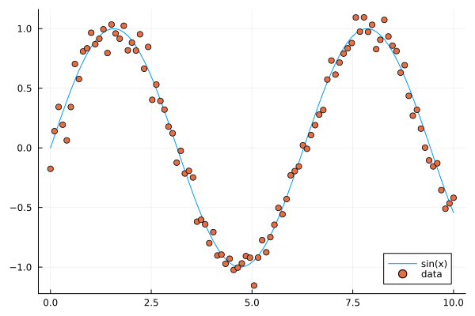
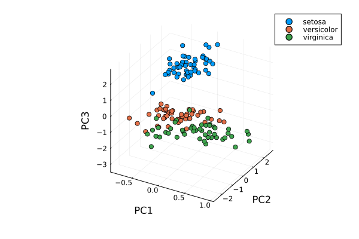

.. _linear_algebra:

Linear algebra
==============

.. questions::

   - How can I create vectors and matrices in Julia?
   - How can I perform vector and matrix operations in Julia?
     
.. instructor-note::

   - 60 min teaching
   - 30 min exercises

List comprehension, slicing and vectorization
---------------------------------------------

One can create vectors in a simple way similar to Python.

.. code-block:: julia

   # range notation
   1:88
   range(1,88) == 1:88 # true
   1:0.23:12 # from 1.0 to 11.81 in steps 0.23

   # list comprehension
   [i^2 for i in range(1,40)] # 40-element Vector

   # conditional list comprehension
   [i^2 for i in range(1,40) if i%5==0] # 8-element Vector

   # if else in list comprehension
   [if x > 3 x else x^2 end for x in 1:5] # 1,4,9,4,5
   # note the whole if-else clause if x > 3 x else x^2 end

   # another way to do conditionals
   [3 < x ? x : x^2 for x in 1:5] # 1,4,9,4,5

   # similar
   [x < y ? x : x*y for (x, y) in zip([1 2 3 4 5], [1 1 2 2 3])]
   # 1,2,6,8,15

   # loop over product set
   [x - y for x in 1:10, y in 1:10]

.. code-block:: text

   10×10 Matrix{Int64}:
    0  -1  -2  -3  -4  -5  -6  -7  -8  -9
    1   0  -1  -2  -3  -4  -5  -6  -7  -8
    2   1   0  -1  -2  -3  -4  -5  -6  -7
    ...                 ...
    8   7   6   5   4   3   2   1   0  -1
    9   8   7   6   5   4   3   2   1   0

.. code-block:: julia

   f(x,y)=x*y # f (generic function with 1 method)
   A = [1,2,3,4]
   B = [2,3,4,5]
   f.(A, B) # 2,6,12,20

   # another way
   for x in zip(A,B)
       println(x[1]*x[2])
   end

   # and another way
   [x*y for (x, y) in zip(A, B)]

   # slicing
   X = [x^2 for x in range(1,11)]
   X[4:9] # 16,25,36,49,64,81
   X[8:end] # 64,81,100,121
   # uniform distribution on [0,1]
   X = rand(5,5) # random 5x5-matrix
   X[1,:] # first row
   X[:,3] # third column
   X[2,4] # element in row 2, column 4

Vectorization is done with the dot syntax similar to Matlab.

.. code-block:: julia

   # vectorization
   A.^2 # [1,4,9,16]
   A .+ B
   A + B == A .+ B # true

   sin(A)
   # ERROR: MethodError: no method matching sin(::Vector{Int64})

   sin.(A) # 4-element Vector

   # add constant to vector
   A + 3 # ERROR: MethodError: no method matching +(::Vector{Int64}, ::Int64)
   A .+ 3 # 4,5,6,7

   # vectorize everywhere
   @. sin(A) + cos(A)
   @. A+A^2-sin(A)*sin(B)

.. code-block:: text

   julia> @. A+A^2-sin(A)*sin(B)

   4-element Vector{Float64}:
     1.2348525987657073
     5.871679939797543
    12.106799974237582
    19.27428371612359

An example where vectorization, random vectors and Plot are used:

.. code-block:: julia

   using Plots

   x = range(0, 10, length=100)
   # vector has length 100
   # from 0 to 10 in 99 steps of size 10/99=0.101...

   y = sin.(x)
   y_noisy = @. sin(x) + 0.1*randn() # normally distributed noise

   plt = plot(x, y, label="sin(x)")
   plot!(x, y_noisy, seriestype=:scatter, label="data")

   # to save figure in file
   # savefig("sine_with_noise.png")

   display(plt)

   Sine function with noise.

Adding elements to existing arrays (appending arrays).

.. code-block:: julia

   # pushing elements to vector
   U = [1,2,3,4]
   push!(U, 55) # [1,2,3,4,55]
   pop!(U) # 55
   U # [1,2,3,4]

   # Array of type Any
   U = []
   push!(U, 5) # [5]
   u = [1,2,3]
   push!(U, u) # [5, [1,2,3]]

   # references
   u = [1,2,3,4]
   v = u
   v[2] = 33
   v # [1,33,3,4]
   u # [1,33,3,4]

   # using copy
   u = [1,2,3,4]
   v = copy(u)
   v[2] = 33
   v # [1,33,3,4]
   u # [1,2,3,4]

   # curiosity: push! stores a reference to the object pushed, not a copy
   u[2] = 77
   U # [5, [1,77,3]]

   # Can use copy if want other behavior
   U = []
   push!(U, 5) # [5]
   u = [1,2,3]
   push!(U, u) # [5, copy(u)]
   u[2] = 77
   U # is still [5, [1,2,3]]
   # however
   v = U[2]
   v[2] = 77
   U # [5, [1,77,3]]

Matrix and vector operations
----------------------------

Recall that matrices and vectors may be defined as follows:

.. code-block:: julia

   # define some column vectors
   v1 = [1.0, 2.0, 3.0]
   v2 = v1.^2

   # combine column vectors into 3x3 matrix
   A = [v1 v2 [7.0, 6.0, 5.0]]

   # another way to make matrices
   M = [5 -3 2;15 -9 6;10 -6 4]

   # common matrices and vectors:

   # zeros
   zeros(5) # [0,0,0,0,0]
   zeros(5,5) # 5x5-matrix of zeros

   # ones
   ones(5) # [1,1,1,1,1]
   zeros(5,5) # 5x5-matrix of ones

   # random matrix
   M = randn(5,5) # normally distributed 5x5-matrix

   # identity matrix (may not need this, see operator I below)
   I(5) # 5x5 identity matrix
   I(5)*M == M # true

.. code-block:: text

   julia> A
   3×3 Matrix{Float64}:
    1.0  1.0  7.0
    2.0  4.0  6.0
    3.0  9.0  5.0

   julia> M
   3×3 Matrix{Int64}:
     5  -3  2
    15  -9  6
    10  -6  4

.. code-block:: julia

   # vector addition and scaling
   v1 + v2
   v1 - 0.5*v2

   B = [v3 v2 v1]

   # matrix vector multiplication
   A*v1

   # matrix multiplication
   A*B
   A^5

.. code-block:: text

   julia>  v1+v2
   3-element Vector{Float64}:
     2.0
     6.0
    12.0

   julia> v1 - 0.5*v2
   3-element Vector{Float64}:
     0.5
     0.0
    -1.5

   julia> A*B
   3×3 Matrix{Float64}:
    44.0  68.0  24.0
    44.0  72.0  28.0
    48.0  84.0  36.0

Standard operations such as rank, determinant, trace, matrix multiplication,
transpose, matrix inverse, identity operator, eigenvalues, eigen vectors and so on:

.. code-block:: julia

   # rank of matrix
   rank(A) # full rank 3

   # rank is numerical rank
   # counting how many singular values of A
   # have magnitude greater than a tolerance
   rank([[1,2,3] [1,2,3] + [2,5,7]*0.5]) # rank 2
   rank([[1,2,3] [1,2,3] + [2,5,7]*1e-14]) # rank 2
   rank([[1,2,3] [1,2,3] + [2,5,7]*1e-15]) # rank 1

   # determinant
   det(A) # 16

   # lower rank matrix
   C = [v1 v2 v1+0.66*v2]

   rank(C) # rank 2

   # 6x6 matrix
   D = [A A;A A]
   rank(D) # 3
   det(D) # 0

   # trace
   tr(A) # 10

   # eigen vectors and eigenvalues
   eigen(A)

   # identity operator (does not build identity matrix)
   I
   A*I # A
   I*D # D

   # matrix inverse
   inv(A)
   inv(A)*A # identity matrix
   A*inv(A) # identity matrix

   # solving linear systems of equations
   u = A*v1
   # solve A*x = u with least squares
   A \ u # v1
   # solve in another way
   inv(A)*u # v1

   # matrix must have full rank
   inv(C) # ERROR: SingularException(3)

   # nilpotent matrix M from above
   rank(M) # 1
   M*M # zero matrix

   # transpose
   transpose(A)
   A' # transpose of real matrix
   # complex matrix
   E = (A+im*A)
   E' # Hermitian conjugate

   # dot product
   dot(v1, v2) # 36
   v1'*v2 # 36

   # cross product of 3-vectors
   cross(v1, v2)
   dot(cross(v1, v2), v1) # 0 (orthogonal)

.. code-block:: text

   julia> eigen(A)
   Eigen{Float64, Float64, Matrix{Float64}, Vector{Float64}}
   values:
   3-element Vector{Float64}:
    -3.250962397052609
    -0.3615511210246384
    13.61251351807725
   vectors:
   3×3 Matrix{Float64}:
    -0.821765  -0.96124   -0.440897
    -0.211254   0.228475  -0.539484
     0.529221   0.154329  -0.717333

Timing
------

Some examples of timing and benchmarking.

.. code-block:: julia

   using BenchmarkTools

   function my_product(A, B)
       for x in zip(A,B)
           push!(C, x[1]*x[2])
       end
       C
   end

   A = randn(10^8)
   B = randn(10^8)
   C = Float64[]

   # @time includes compilation time and garbage collection
   @time my_product(A, B);
   @time A.*B;

   println()
   tic = time()
   C = my_product(A, B)
   toc = time()
   println("Manual time measure: ", toc - tic)
   println()

   # @btime does not includes compilation time
   @btime my_product(A, B);
   @btime A.*B;

.. code-block:: julia

   4.116207 seconds (100.01 M allocations: 1.634 GiB, 13.91% gc time, 0.55% compilation time)
   0.191240 seconds (4 allocations: 762.940 MiB, 0.63% gc time)

   Manual time measure: 3.63100004196167

   3.062 s (100000000 allocations: 1.49 GiB)
   186.446 ms (4 allocations: 762.94 MiB)

.. questions::

   Benchmark time varies quite a lot between runs. Why?

Random matrices and sparse matrices
-----------------------------------

Here is how you can create random matrices and vectors with various
distributions.

.. code-block:: julia

   # normal distribution as above
   randn(100, 100) # 100x100-matrix

   # uniform distribution
   rand() # uniformly distributed random number in [0,1]
   rand(5) # uniform 5-vector
   rand(5,5) # uniform 5x5-matrix
   rand(1:88) # random element of 1:88
   rand(1:88, 5) # 5-vector
   rand("abc", 5, 5) # 5x5-matrix random over [a,b,c]

More involved computations with random variables can be done with the
Distributions package.

.. code-block:: julia

   using Distributions
   m = [0,0,1.0] # mean
   S = [[1.0 0 0];[0 2.0 0];[0 0 3.0]] # covaraince matrix
   X = MvNormal(m, S) # multivariate normal distribution
   rand(X) # sample

   # binomial and multinomial distribution
   Y = Binomial(10, 0.3)
   rand(Y) # sample
   Y = Multinomial(10, [0.3,0.6, 0.1])
   rand(Y) # sample

   # Exponential distribution
   E = Exponential()
   # draw 10 samples from E (all will be non-negative)
   rand(E, 10)

   # discrete multivariate
   rand(5, 5) .< 0.1 # 0.1 chance of 1

Sparse matrices may be constructed with the SparseArrays package.

.. code-block:: julia

   using SparseArrays

   # 100x100-matrix with density 10% (non-zero elements)
   M = rand(100,100) .< 0.1
   S = sparse(M) # SparseMatrixCSC

   typeof(M) # BitMatrix (alias for BitArray{2})
   typeof(S) # SparseMatrixCSC{Bool, Int64}

   # 100x100-matrix with density 10%, as sparse matrix directly
   S = sprand(100, 100, 0.1)

Loading a dataset
-----------------

To prepare our illustration of PCA, we start by downoading Fisher's
iris dataset. This dataset contains measurements from 3 different
species of the plant iris: setosa, versicolor and virginica with 50
datapoints of each species. There are four measurements for datapoint,
namely sepal length, sepal width, petal length and petal width (in
centimeters).

   Image of iris by David Iliff.

To obtain the data we use the RDatasets package:

.. code-block:: julia

   using DataFrames, LinearAlgebra, Statistics, RDatasets, Plots
   df = dataset("datasets", "iris")

Principal Component Analysis (PCA)
----------------------------------

We will now illustrate how PCA can be performed on the iris
dataset. First extract the first four columns (the features described
above) as well as the labels separately:

.. code-block:: julia

   Xdf = df[:,1:4]
   X = Matrix(Xdf)
   y = df[:,5]

Firt we center the data by substracting the mean and in addition we
normalize by dividing by the standard deviation:

.. code-block:: julia

   m = mean(X, dims=1)
   r = size(X)[1]
   X = X - ones(r,1)*m
   s = ones(1, 4)./std(X, dims=1)
   X = X.*s

Now compute the covariance matrix together with its eigenvectors and eigenvalues:

.. code-block:: julia

   M = transpose(X)*X
   P = eigvecs(M)
   E = eigvals(M)

.. code-block:: text

   4-element Vector{Float64}:
      3.08651062786422
     21.866774460125956
    136.19054024874245
    434.8561746632673

We see that the first eigenvalue is quite a bit smaller than the for
instance the last one. Our data lies approximately in a 3-dimensional
subspace. Most of the variance in the dataset happens in this subspace.

The basis of eigenvectors we got is orthogonal and normalized:

.. code-block:: julia

    transpose(P)*P
		
We may perform dimensionality reduction by projecting the data to this subspace: 

.. code-block:: julia

    # projection of dataset onto orthonormal basis of eigenvectors
    # the three with largest eigenvalues
    Xp = X*P[:,2:4]

    # This following results in three least important directions, interesting comparison
    # Xp = X*P[:,1:3]

Plotting the result:

.. code-block:: julia

   setosa = Xp'[:,y.=="setosa"]
   versicolor = Xp'[:,y.=="versicolor"]
   virginica = Xp'[:,y.=="virginica"]

   plt = plot(setosa[1,:],setosa[2,:],setosa[3,:], seriestype=:scatter, label="setosa")
   plot!(versicolor[1,:],versicolor[2,:],versicolor[3,:], seriestype=:scatter, label="versicolor")
   plot!(virginica[1,:],virginica[2,:],virginica[3,:], seriestype=:scatter, label="virginica")
   plot!(xlabel="PC1", ylabel="PC2", zlabel="PC3")

   display(plt)

   Scatter plot of the projected data.

Exercises
---------

.. exercise:: Sparse matrix computations

   Create a sparse 5000x5000-matrix S with roughly 5000 non-zero
   elements uniformly distributed on [0,1]. Compute S^10 and time the
   computation. Compare with S as a Matrix and a SparseMatrixCSC.

   .. solution:: Here is a suggestion

      .. code-block:: julia

         using SparseArrays, BenchmarkTools

         n = 5000
         S = sprand(n, n, 1/n) # sparse nxn-matrix with density 1/n
         B = Matrix(S) # as Matrix

         @btime S^10;
         @btime B^10;

      .. code-block:: text

         545.400 μs (29 allocations: 806.98 KiB)
         6.343 s (8 allocations: 762.94 MiB)

The following exercise is adapted from the `Julia language companion
<https://web.stanford.edu/~boyd/vmls/vmls-julia-companion.pdf>`_ of
the `book
<https://web.stanford.edu//~boyd/vmls/vmls.pdf#algorithmctr.5.1>`_
*Introduction to Applied Linear Algebra – Vectors, Matrices, and Least
Squares* by Stephen Boyd and Lieven Vandenberghe.

Below we will consider the Gram-Schmidt process:

Given a set of linearly independent vectors :math:`{a_1,\dots,a_k}`
return an orthogonal basis of their span.

If the vectors are linearly dependent, return an orthogonal basis of
:math:`{a_1,\dots,a_{i-1}}` where :math:`a_i` is the first vector
linearly dependent on the previous ones. It is reasonable to consider
numerical linear dependence up to a small tolerance, that is there is
a linear combination of the vectors that is almost zero.

The algorithm in pseudocode goes as follows. First define the
orthogonal projection of a vector :math:`a` on a vector :math:`q` as

.. math::

   \textrm{proj}_q(a)=\frac{\langle a, u \rangle}{||u||},

where :math:`\langle .,. \rangle` is the dot product and :math:`||
\cdot ||` is the norm. For linearly independent vectors, the algorithm
goes:

  * :math:`\tilde{q}_1 = a_1`
  * :math:`q_1 = \tilde{q}_1/||\tilde{q}_1||`
  * :math:`\tilde{q}_2 = q_1 - \textrm{proj}_{q_1}(a_2)`
  * :math:`q_2 = \tilde{q}_2/||\tilde{q}_2||`,

and so on. That is for :math:`i=1,2,3,\ldots,k`:

  * Compute: :math:`\tilde{q}_i = q_{i-1} - \sum_{j=1}^{i-1} \textrm{proj}_{q_j}(a_i)`
  * Normalize: :math:`q_i = q_i/||q_i||`,

and return :math:`{q_1,\dots,q_k}`.

If at some step, :math:`||\tilde{q}_i|| = 0`, we cannot normalize,
linear dependence has been detected and we return
:math:`q_1,\dots,q_{i-1}`.

.. exercise:: Gram-Schmidt process

   Implement the Gram-Schmidt process in Julia.

   .. solution:: Here is a suggestion

      .. code-block:: julia

         # input is a vector of vectors a = [a_1, a_2, a_3]
	     # for vectors a_1, a_2, a_3

	     using LinearAlgebra

         function gram_schmidt(a; tol = 1e-10)

         q = []
         for i = 1:length(a)
             qtilde = a[i]
             for j = 1:i-1
                 qtilde -= (q[j]'*a[i]) * q[j]
             end
             if norm(qtilde) < tol
                println("Vectors are linearly dependent.")
                return q
             end
             push!(q, qtilde/norm(qtilde))
         end;
         return q
         end

.. exercise:: Check Gram-Schmidt

   Write a check for your Gram-Schimdt program that the output
   consists of orthonormal vectors. Also, for linearly independent
   input vectors, check that the spans of input and output are the
   same.

   .. solution:: Quick and dirty suggestion

      .. code-block:: julia

         using LinearAlgebra

         a_1 = [1,2,3,4];
         a_2 = [2,3,4,5];
         a_3 = [3,4,5,7];
         a = [a_1, a_2, a_3];

         Q = gram_schmidt(a);

         # create matrices
         M = [Q[1] Q[2] Q[3]]
         N = [Q[1] Q[2] Q[3] a_1 a_2 a_3]

         # test orthogonality, should be 3x3-identity matrix
         M'*M
         # test span with numerical rank, should be 3
         rank(N)

Extra exercises
---------------

.. exercise:: Matrix factorizations

   Perform various factorizations on a matrix using standard
   libraries: QR-factorization, LU-factorization, Diagonalization,
   Singular-Value-Decomposition.

.. exercise:: Distributions and histograms

   Plot histograms of some distributions: normal, uniform, binomial,
   multinomial, exponential, Cauchy, Poisson or other distributions of
   choice.

