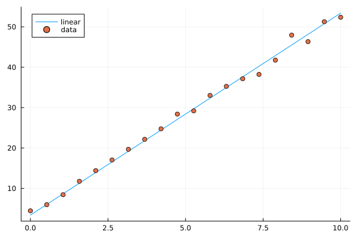
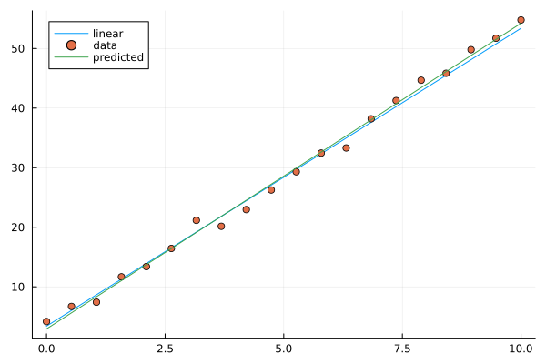
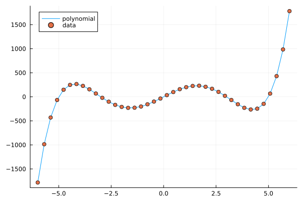
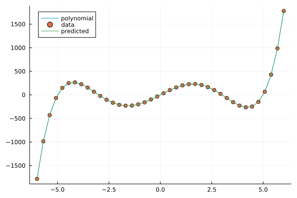
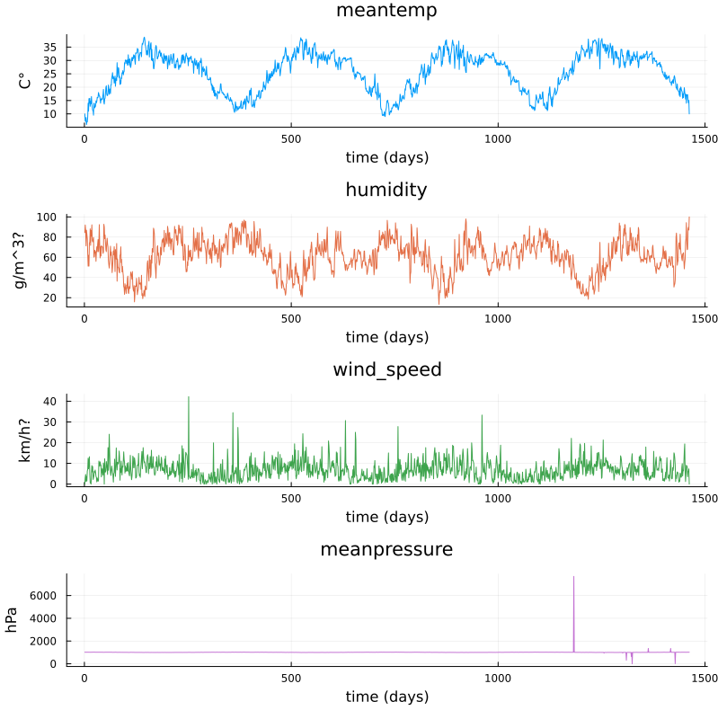
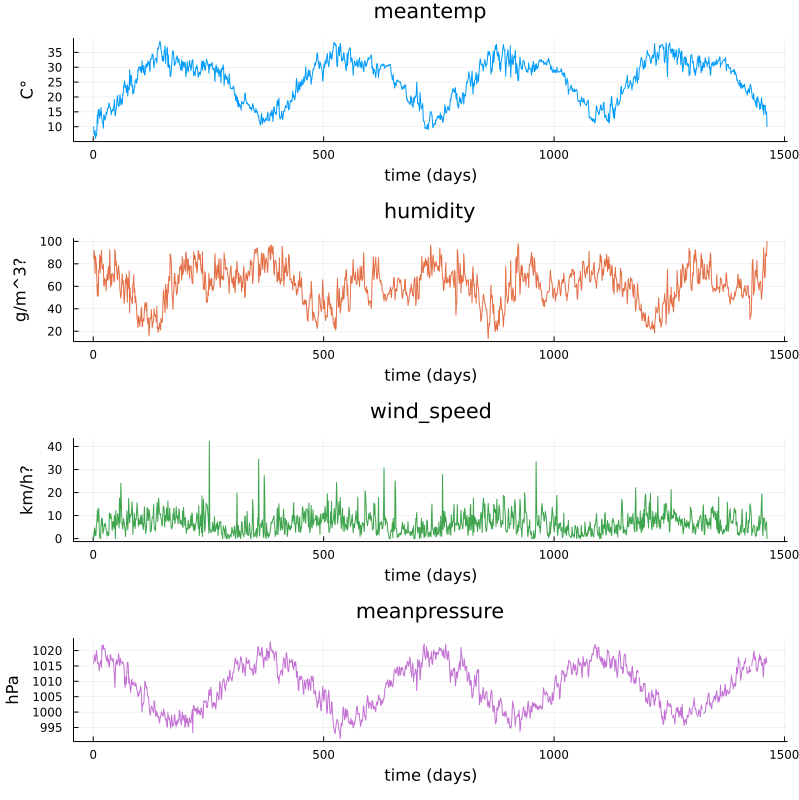

.. _regression:

Linear regression
=================

.. questions::

   - How can I perform simple linear regression in Julia?
   - How to do linear regression with non-linear basis functions?
   - How do to basic Fourier based regression?
   - How to perform non-linear regression and time-series prediction?

.. instructor-note::

   - 90 min teaching
   - 60 min exercises

.. callout::

   The code in this lesson is written for Julia v1.12.6.

Linear regression with synthetic data
-------------------------------------

We begin with some simple examples of linear regression on generated data.
For the models we will use the package GLM (Generalized Linear Models),
which among other things contains linear regression models.

Let's start by generating some data along a line and add normally distributed noise.

.. code-block:: julia

   using Plots, GLM, DataFrames

   X = Vector(range(0, 10, length=20))
   y = 5*X .+ 3.4
   y_noisy = @. 5*X + 3.4 + randn()

   plt = plot(X, y, label="linear")
   plot!(X, y_noisy, seriestype=:scatter, label="data")

   display(plt)

Given data :math:`x_1,x_2,\ldots,x_k` and responses :math:`y_1,y_2,\ldots,y_k`, the ordinary least squares method
finds the linear function :math:`l(x) = ax+b` minimizing the sum of squares error :math:`\sum_i (l(x_i)-y_i)^2`.

.. code-block:: julia

   using Plots, GLM, DataFrames

   X = Vector(range(0, 10, length=20))
   y = 5*X .+ 3.4
   y_noisy = @. 5*X + 3.4 + randn()

   df = DataFrame(cX=X, cy=y_noisy)
   lm1 = fit(LinearModel, @formula(cy ~ cX), df)

   # the above is the same as @formula(cy ~ cX + 1), which also works

   # alternative syntax
   # lm(@formula(cy ~ cX), df)

.. code-block:: text

   StatsModels.TableRegressionModel{LinearModel{GLM.LmResp{Vector{Float64}}, GLM.DensePredChol{Float64, LinearAlgebra.CholeskyPivoted{Float64, Matrix{Float64}, Vector{Int64}}}}, Matrix{Float64}}

   cy ~ 1 + cX # the constant term (intercept) is there, same as if we do @formula(cy ~ cX + 1)

   Coefficients:
   ───────────────────────────────────────────────────────────────────────
                  Coef.  Std. Error      t  Pr(>|t|)  Lower 95%  Upper 95%
   ───────────────────────────────────────────────────────────────────────
   Intercept)  3.46467   0.448322    7.73    <1e-06    2.52278    4.40656
   cX          5.05127   0.0766497  65.90    <1e-22    4.89024    5.21231
   ───────────────────────────────────────────────────────────────────────

.. code-block:: julia

   # note the order in the formula argument
   fit(LinearModel, @formula(cX ~ cy), df) # this would model line with slope 1/5 and intercept -3.4/5

Now let's plot the resulting prediction (green) together with the underlying line (blue) and data points.

.. code-block:: julia

   using Plots, GLM, DataFrames

   X = Vector(range(0, 10, length=20))
   y = 5*X .+ 3.4
   y_noisy = @. 5*X + 3.4 + randn()

   plt = plot(X, y, label="linear")
   plot!(X, y_noisy, seriestype=:scatter, label="data")

   df = DataFrame(cX=X, cy=y_noisy)
   lm1 = fit(LinearModel, @formula(cy ~ cX), df)

   y_pred = GLM.predict(lm1)

   # alternative: do it explicitly
   # coeffs = coeftable(lm1).cols[1] # intercept and slope
   # y_pred = coeffs[1] .+ coeffs[2]*X

   plot!(X, y_pred, label="predicted")

   display(plt)

   lm1

   Image of linear model prediction. The example shown has intercept 2.9 and slope 5.1 (the result depends on random added noise).

Multivariate linear models are done in a similar way. Now we are fitting a multivariate linear function that minimizes the sum of
squares error. In the following example we generate a linear function of 4 variables with random coefficients (normally distributed).
On top of that we add normally distributed noise.

.. code-block:: julia

   using Plots, GLM, DataFrames

   n = 4
   C = randn(n+1,1)
   X = rand(100,n)

   y = X*C[2:end] .+ C[1]
   y_noisy = y .+ 0.01*randn(100,1)

   df = DataFrame(cX1=X[:,1], cX2=X[:,2], cX3=X[:,3], cX4=X[:,4], cy=y_noisy[:,1])

   lm2 = lm(@formula(cy ~ cX1+cX2+cX3+cX4), df)

   display(lm2)
   println("Coefficient vector:")
   print(C)

.. code-block:: text

   cy ~ 1 + cX1 + cX2 + cX3 + cX4

   Coefficients:
   ───────────────────────────────────────────────────────────────────────────
                  Coef.  Std. Error        t  Pr(>|t|)  Lower 95%  Upper 95%
   ───────────────────────────────────────────────────────────────────────────
   (Intercept)  -1.21114   0.00350522  -345.52    <1e-99  -1.2181    -1.20418
   cX1           2.42963   0.00375007   647.89    <1e-99   2.42218    2.43707
   cX2          -0.399002  0.00354803  -112.46    <1e-99  -0.406046  -0.391959
   cX3          -0.500017  0.00358613  -139.43    <1e-99  -0.507136  -0.492897
   cX4           1.46202   0.00365527   399.98    <1e-99   1.45476    1.46928
   ───────────────────────────────────────────────────────────────────────────
   Coefficient vector:
   [-1.2045802862085417; 2.423632187920813; -0.4006938351986558; -0.5016991252146699; 1.4622712737941417;;]

Linear models with basis functions
----------------------------------

Using the package GLM, we can incorporate linear models with basis functions in a convenient way,
that is to model a function as a linear combination of given non-linear functions such polynomials
or trigonometric functions.

.. code-block:: julia

   using Plots, GLM, DataFrames

   # try this polynomial
   X = range(-6, 6, length=40)
   y = X.^5 .- 34*X.^3 .+ 225*X
   y_noisy = y .+ randn(40,)

   plt = plot(X, y, label="polynomial")
   plot!(X, y_noisy, seriestype=:scatter, label="data")

   display(plt)

   A polynomial function with noisy data.

Fitting a polynomial to data
^^^^^^^^^^^^^^^^^^^^^^^^^^^^

Fitting a linear model with basis functions means that we try to approximate our function with for example a polynomial
:math:`p(x)=ax^5+bx^4+cx^3+dx^2+ex+f`. We fit this model to the data in a least squares sense, which works since the model
is linear in the coefficients :math:`a,b,c,d,e,f`, even though non-linear in the data :math:`x`. The degree of the polynomial needed
to get a good fit is not known in advance but for this illustration we pick the same degree (5) as when generating the data.

.. code-block:: julia

   using Plots, GLM, DataFrames

   # try this polynomial
   X = range(-6, 6, length=40)
   y = X.^5 .- 34*X.^3 .+ 225*X
   y_noisy = y .+ randn(40,)

   plt = plot(X, y, label="polynomial")
   plot!(X, y_noisy, seriestype=:scatter, label="data")

   df = DataFrame(cX=X, cy=y_noisy)

   lm3 = lm(@formula(cy ~ cX^5 + cX^4 + cX^3 + cX^2 + cX + 1), df)

   y_pred = GLM.predict(lm3)

   plot!(X, y_pred, label="predicted")

   display(plt)

   lm3

.. code-block:: text

   StatsModels.TableRegressionModel{LinearModel{GLM.LmResp{Vector{Float64}}, GLM.DensePredChol{Float64, LinearAlgebra.CholeskyPivoted{Float64, Matrix{Float64}, Vector{Int64}}}}, Matrix{Float64}}

   cy ~ 1 + :(cX ^ 5) + :(cX ^ 4) + :(cX ^ 3) + :(cX ^ 2) + cX

   Coefficients:
   ───────────────────────────────────────────────────────────────────────────────────────
                        Coef.   Std. Error         t  Pr(>|t|)     Lower 95%     Upper 95%
   ───────────────────────────────────────────────────────────────────────────────────────
   (Intercept)   -0.0354375    0.343821        -0.10    0.9185   -0.734166      0.663291
   cX ^ 5         1.00118      0.000551333   1815.92    <1e-85    1.00006       1.0023
   cX ^ 4        -0.000992084  0.00169158      -0.59    0.5614   -0.00442979    0.00244563
   cX ^ 3       -34.054        0.0236797    -1438.11    <1e-82  -34.1021      -34.0058
   cX ^ 2         0.0230557    0.0571179        0.40    0.6890   -0.0930219     0.139133
   cX           225.511        0.226822       994.22    <1e-76  225.05        225.972
   ───────────────────────────────────────────────────────────────────────────────────────

   Fitting a polynomial to data.

Exercises
---------

Let us illustrate linear regression on real data sets. The first dataset comes from the RDatasets package
and are data from chemical experiments for the production of formaldehyde.
The data columns are amount of Carbohydrate (ml) and Optical Density of a purple color on a spectrophotometer.

Sources:

- Bennett, N. A. and N. L. Franklin (1954), Statistical Analysis in Chemistry and the Chemical Industry, New York: Wiley.
- McNeil, D. R. (1977), Interactive Data Analysis, New York: Wiley.

.. exercise::

   In the exerises below we use the packages GLM, RDatasets, Plots and DataFrames:

   .. code-block:: julia

      using Pkg
      Pkg.add("GLM")
      Pkg.add("RDatasets")
      Pkg.add("Plots")
      Pkg.add("DataFrames")

.. exercise:: Formaldehyde example

   To load the dataset, you can do:

   .. code-block:: julia

      using GLM, RDatasets, Plots
      df = dataset("datasets", "Formaldehyde")

   The columns of the dataframe are called `Carb` and `OptDen` for the amount of Carbohydrate and Optical Density.
   You can plot the data as follows:

   .. code-block:: julia

      plt = plot(df.Carb, df.OptDen, seriestype=:scatter, label="formaldehyde data")
      display(plt)

   To model Density as a linear function of Carbohydrate you can do as follows.
   The `predict` method is used to make model predictions.

   .. code-block:: julia

      model = fit(LinearModel, @formula(OptDen ~ Carb), df)
      y_pred = GLM.predict(model)

   To add the prediction to the plot and print the model results you can do:
   
   .. code-block:: julia
   
      plot!(df.Carb, y_pred, label="model")
      display(plt)
      model

   .. solution:: A suggestion

      .. code-block:: julia

         using GLM, RDatasets, Plots

         df = dataset("datasets", "Formaldehyde")

         plt = plot(df.Carb, df.OptDen, seriestype=:scatter, label="formaldehyde data")

         display(plt)

         model = fit(LinearModel, @formula(OptDen ~ Carb), df)

         y_pred = GLM.predict(model)

         plot!(df.Carb, y_pred, label="model")

         display(plt)

         model

      .. figure:: img/linear_formaldehyde.png
         :align: center

.. exercise:: Changing hyperparameters

   Take a look at the code in the example `Fitting a polynomial to data`_.
   This fit is pretty tight.

   - What happens if you increase the noise by say 100 times?
   - What happens if if you use a degree 6 or 7 polynomial to fit the data instead?

   You can try the second experiment with the original noise level.

   .. solution::

      You can change the following rows:

      .. code-block:: julia

         # y_noisy = y .+ randn(40,)
         y_noisy = y .+ 100*randn(40,)

         # lm3 = lm(@formula(cy ~ cX^5 + cX^4 + cX^3 + cX^2 + cX + 1), df)
         lm3 = lm(@formula(cy ~ cX^7 + cX^6 + cX^5 + cX^4 + cX^3 + cX^2 + cX + 1), df)

Let us have a look at linear regression on real multidimensional data. For this we will use the Rdatasets
package and the "trees" dataset, which consists of measurements on
black cherry trees: girth, height and volume
(see Atkinson, A. C. (1985) Plots, Transformations and Regression. Oxford University Press).

.. exercise:: Black cherry trees

   In this exercise we use also the package StatsBase:

   .. code-block:: julia

      using Pkg
      Pkg.add("StatsBase")

   Load the trees data set as follows:

   .. code-block:: julia

      using GLM, RDatasets, StatsBase, Plots
      # Girth Height and Volume of Black Cherry Trees
      trees = dataset("datasets", "trees")
      df = trees

   Randomly split the data set into a training and testing data set.

   .. code-block:: julia

      n_rows = size(df)[1]
      rows_train = sample(1:n_rows, Int(round(n_rows*0.8)), replace=false)
      rows_test = [x for x in 1:n_rows if ~(x in rows_train)]

      L_train = df[rows_train,:]
      L_test = df[rows_test,:]

   It is reasonable to try to fit the logarithm of volume as a linear function of
   the logarithm of the height and logarithm of the girth. This is because the
   volume is presumably roughly proportional to the height times the girth squared.

   .. code-block:: julia

      # reasonable to look at logarithms since we can expect something like V~h*g^2 and
      # log V = constant + log h + 2log g
      model = fit(LinearModel, @formula(log(Volume) ~ log(Girth) + log(Height)), L_train)

   Lastly, make predictions on the training set according to the model and compute the
   root mean squared error of the prediction (for instance on the training set).

   .. code-block:: julia

      Z = L_train
      # Z = L_test
      y_pred = GLM.predict(model, Z)

      # Root Mean Squared Error
      rmse = sqrt(sum((exp.(y_pred) - Z.Volume).^2)/size(Z)[1])

   .. solution:: The whole script

      .. code-block:: julia

         using GLM, RDatasets, StatsBase, Plots
         # Girth Height and Volume of Black Cherry Trees
         trees = dataset("datasets", "trees")
         df = trees

         n_rows = size(df)[1]
         rows_train = sample(1:n_rows, Int(round(n_rows*0.8)), replace=false)
         rows_test = [x for x in 1:n_rows if ~(x in rows_train)]

         L_train = df[rows_train,:]
         L_test = df[rows_test,:]

         # reasonable to look at logarithms since can expect something like V~h*r^2 and
         # log V = constant + log h + 2log r
         model = fit(LinearModel, @formula(log(Volume) ~ log(Girth) + log(Height)), L_train)

         Z = L_train
         # Z = L_test
         y_pred = GLM.predict(model, Z)

         # Root Mean Squared Error
         rmse = sqrt(sum((exp.(y_pred) - Z.Volume).^2)/size(Z)[1])

         println(rmse)
         df

      .. code-block:: julia-repl

         2.2631848027992776 # rmse

         31×3 DataFrame
          Row │ Girth    Height  Volume
              │ Float64  Int64   Float64
         ─────┼──────────────────────────
            1 │     8.3      70     10.3
            2 │     8.6      65     10.3
            3 │     8.8      63     10.2
            4 │    10.5      72     16.4
            5 │    10.7      81     18.8
            6 │    10.8      83     19.7
            7 │    11.0      66     15.6
            8 │    11.0      75     18.2
            9 │    11.1      80     22.6
           10 │    11.2      75     19.9
           11 │    11.3      79     24.2

         And so on (31 data points).

.. exercise:: Trigonometric basis functions

   Try a similar example as the polynomial above but with trigonometric functions :math:`y(x)=\cos(x)+\cos(2x)`.
   Here is a snippet that generates data for this example:
   
   .. code-block:: julia
   
      using Plots, GLM, DataFrames

      X = range(-6, 6, length=100)
      y = cos.(X) .+ cos.(2*X)
      y_noisy = y .+ 0.1*randn(100,)

   To make a dataframe out of the data and fit a linear model to it, you can do:

   .. code-block:: julia
   
      df = DataFrame(X=X, y=y_noisy)
      lm1 = lm(@formula(y ~ 1 + cos(X) + cos(2*X) + cos(3*X) + cos(4*X)), df)

   .. solution:: A suggestion.

      .. code-block:: julia

         using Plots, GLM, DataFrames

         # try a cosine combination
         X = range(-6, 6, length=100)
         y = cos.(X) .+ cos.(2*X)
         y_noisy = y .+ 0.1*randn(100,)

         plt = plot(X, y, label="waveform")
         plot!(X, y_noisy, seriestype=:scatter, label="data")

         display(plt)

         df = DataFrame(X=X, y=y_noisy)

         lm1 = lm(@formula(y ~ 1 + cos(X) + cos(2*X) + cos(3*X) + cos(4*X)), df)

      .. code-block:: text

         StatsModels.TableRegressionModel{LinearModel{GLM.LmResp{Vector{Float64}}, GLM.DensePredChol{Float64, LinearAlgebra.CholeskyPivoted{Float64, Matrix{Float64}, Vector{Int64}}}}, Matrix{Float64}}

         y ~ 1 + :(cos(X)) + :(cos(2X)) + :(cos(3X)) + :(cos(4X))

         Coefficients:
         ────────────────────────────────────────────────────────────────────────────
                           Coef.  Std. Error      t  Pr(>|t|)    Lower 95%  Upper 95%
         ────────────────────────────────────────────────────────────────────────────
         (Intercept)   0.0130408   0.0108222   1.21    0.2312  -0.00844393  0.0345256
         cos(X)        0.981561    0.015653   62.71    <1e-78   0.950486    1.01264
         cos(2X)       0.984984    0.0156219  63.05    <1e-78   0.953971    1.016
         cos(3X)      -0.0135547   0.015573   -0.87    0.3863  -0.044471    0.0173616
         cos(4X)       0.0148532   0.0155105   0.96    0.3407  -0.015939    0.0456454
         ────────────────────────────────────────────────────────────────────────────

      .. figure:: img/linear_basis_2.png
         :align: center

         Fitting trigonometric functions to data.

Loading data
------------

We will now have a look at a climate data set containing daily mean
temperature, humidity, wind speed and mean pressure at a location in
Delhi India over a period of several years. The data set is available
`here <https://www.kaggle.com/datasets/sumanthvrao/daily-climate-time-series-data/>`__.
In the context of the Delhi dataset we have borrowed some elements of Sebastian Callh's personal
blog post *Forecasting the weather with neural ODEs* found `here
<https://sebastiancallh.github.io/post/neural-ode-weather-forecast/>`__.

.. code-block:: julia

   using DataFrames, CSV, Plots, Statistics

   # data_path = <path-to-data-file>
   # a string, full path to data file DailyDelhiClimateTrain.csv
   # uploaded in julia-for-hpda/content/data
   df_train = CSV.read(data_path, DataFrame)
   df_train

   M = [df_train.meantemp df_train.humidity df_train.wind_speed df_train.meanpressure]
   plottitles = ["meantemp" "humidity" "wind_speed" "meanpressure"]
   plotylabels =  ["C°" "g/m^3?" "km/h?" "hPa"]
   # color=[1 2 3 4] gives default colors
   plot(M, layout=(4,1), color=[1 2 3 4], legend=false, title=plottitles,
   xlabel="time (days)", ylabel=plotylabels, size=(800,800))

   Plots of measurements.

The mean pressure data field seems to contain some unreasonably large values. Let us filter those out and consider these missing data.

.. code-block:: julia

   using DataFrames, CSV, Plots, Statistics

   # data_path = <path-to-data-file>
   # a string, full path to data file DailyDelhiClimateTrain.csv
   # uploaded in julia-for-hpda/content/data
   df_train = CSV.read(data_path, DataFrame)

   M = [df_train.meantemp df_train.humidity df_train.wind_speed df_train.meanpressure]

   plottitles = ["meantemp" "humidity" "wind_speed" "meanpressure"]
   plotylabels =  ["C°" "g/m^3?" "km/h?" "hPa"]

   df_train[df_train.meanpressure .< 950,:meanpressure] .= NaN
   df_train[1050 .< df_train.meanpressure,:meanpressure] .= NaN

   M = [df_train.meantemp df_train.humidity df_train.wind_speed df_train.meanpressure]

   # color=[1 2 3 4] gives default colors
   plt = plot(M, layout=(4,1), color=[1 2 3 4], legend=false, title=plottitles,
   xlabel="time (days)", ylabel=plotylabels, size=(800,800))

   display(plt)

   Plots of cleaned up data.

