Non-linear regression and time-series prediction
------------------------------------------------

In this section we will have a look at non-linear regression methods.

Climate data
^^^^^^^^^^^^

Now we will consider the problem of predicting one of the climate variables from the others, for example temperature from humidity, wind speed and pressure. In the process we will see how to set up and train a neural network in Julia using the package Flux.

Background on neural networks can be found here :download:`download slides </slides/julia_kurs_notes.pdf>`.

.. callout:: Some terminology relating to neural networks

   Neural networks can be used to approximate non-linear functions. We define the network as a chain (composition)
   of so-called dense layers. The performance of the network on the training data is measured in terms of the loss
   function. In our case this is the mean squared error (mse), which is an analog of the sum of squares error
   used in linear regression. The square root of the mean squared error is called root mean squared error (rmse).
   The training of the network is the process of minimizing the loss function. Here, this is done with the
   gradient descent method using an optimizer (in this case ADAM). Gradient descent is an iterative method
   which repeatedly takes a step in the negative gradient direction of the loss function. Each such iteration
   is known as an epoch.

.. code-block:: julia

   using DataFrames, CSV, Plots, Statistics, Dates, GLM, Flux, StatsBase
   using MLJ: shuffle, partition
   using Flux: train!

   # data_path = <path-to-data-file>
   # a string, full path to data file DailyDelhiClimateTrain.csv
   df = CSV.read(data_path, DataFrame)

   # clean up data, drop rows
   df = filter(:meanpressure => x -> 950 < x < 1050, df)

   topredict = "mean temp"
   y = df.meantemp
   mhumid = mean(df.humidity)
   mspeed = mean(df.wind_speed)
   mpress = mean(df.meanpressure)
   X = [(df.humidity .- mhumid) (df.wind_speed .- mspeed) (df.meanpressure .- mpress)]
   # X = [(df.humidity .- 50) (df.wind_speed .- 5) (df.meanpressure .- 1000)]

   # can convert data to Float32
   # aviods Warning and faster training
   # X = Matrix{Float32}(X)
   # y = Vector{Float32}(y)

   z = eachindex(y)

   # 70:30 split in training and testing
   # shuffle or straight split
   train, test = partition(z, 0.7, shuffle=false)
   X_train = X[train, :]
   y_train = y[train, :]
   X_test = X[test, :]
   y_test = y[test, :]

   function draw_results(X_train, X_test, y_train, y_test, model)
       y_pred_train = model(X_train')'

       plt = scatter(train, y_train, title="Non-linear model of "*topredict, label="data train")
       scatter!(train, y_pred_train, label="prediction train")

       y_pred_test = model(X_test')'

       scatter!(test, y_test, label="data test")
       scatter!(test, y_pred_test, label="prediction test")

       display(plt)

       rmse_train = sqrt(Flux.Losses.mse(y_train, y_pred_train))
       rmse_test = sqrt(Flux.Losses.mse(y_test, y_pred_test))

       println(topredict)
       println("rmse train: ", rmse_train)
       println("rmse test: ", rmse_test)
   end

   init=Flux.glorot_uniform()
   model = Flux.Chain(
               Flux.Dense(3, 10, tanh, init=init, bias=true),
               # Flux.Dense(10, 10, tanh, init=init, bias=true),
               # Flux.Dropout(0.04),
               Flux.Dense(10, 1, init=init, bias=true)
   )

   loss(model, tX, ty) = Flux.Losses.mse(model(tX'), ty')

   data = [(X_train, y_train)]

   opt_state = Flux.setup(Flux.Adam(0.01), model) # learning rate 0.01

   train_loss = []
   test_loss = []
   n_epochs = 1000

   # to animate training
   # replace the rest of the code from here with snippet below

   for epoch in 1:n_epochs
       train!(loss, model, data, opt_state)
       ltrain = sqrt(loss(model, X_train, y_train))
       ltest = sqrt(loss(model, X_test, y_test))
       push!(train_loss, ltrain)
       push!(test_loss, ltest)
       println("Epoch: $epoch, rmse train/test: ", ltrain, " ", ltest)
   end

   draw_results(X_train, X_test, y_train, y_test, model)

   plt = plot(train_loss, title="Losses (root mean square error)", label="training", xlabel="epochs")
   plot!(test_loss, label="test")
   display(plt)

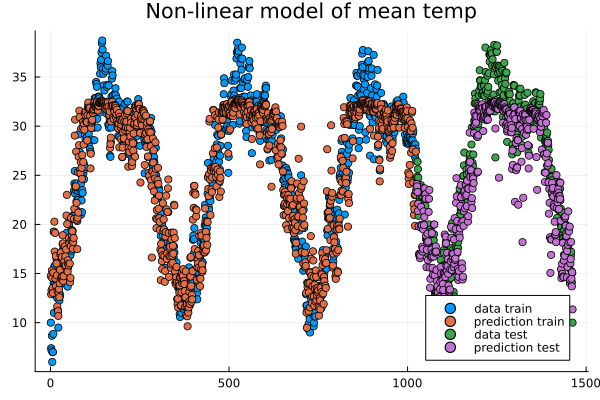

   Data points and predictions.

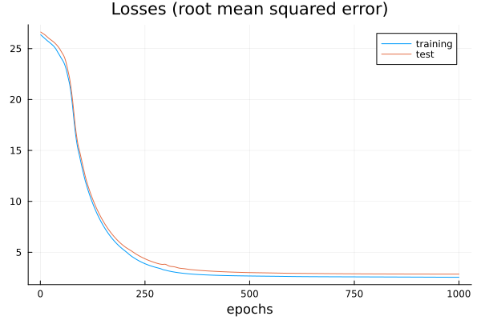

   The losses during training.

.. code-block:: text

   Epoch: 997, rmse train/test: 2.321958298905668 2.8623720534428925
   Epoch: 998, rmse train/test: 2.3217000741076217 2.862347448996424
   Epoch: 999, rmse train/test: 2.321443844030064 2.8623211237184116
   Epoch: 1000, rmse train/test: 2.3211893059494684 2.8622934109353464
   mean temp
   rmse train: 2.3211893059494684
   rmse_test: 2.8622934109353464

It is interesting to animate the predictions during the training of the neural network. This will also give us a quick look at animation in Julia.

.. code-block:: julia

   # instead of the training loop above
   # do this to save an animation as a gif

   anim = @animate for epoch in 1:n_epochs

       train!(loss, model, data, opt_state)
       ltrain = sqrt(loss(model, X_train, y_train))
       ltest = sqrt(loss(model, X_test, y_test))
       push!(train_loss, ltrain)
       push!(test_loss, ltest)
       println("Epoch: $epoch, rmse train/test: ", ltrain, " ", ltest)

       y_pred_train = model(X_train')'
       y_pred_test = model(X_test')'

       scatter(train, y_train, title="Non-linear model of "*topredict, label="data train", yrange=[0,40])
       scatter!(train, y_pred_train, label="prediction train")
       scatter!(test, y_test, label="data test")
       scatter!(test, y_pred_test, label="prediction test")

   end every 2 # include every second frame

   gif(anim, "anim_points_training.gif")

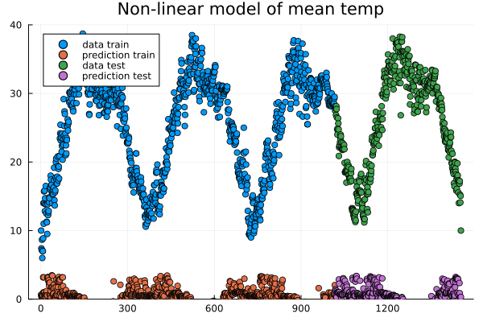

   Evolution of prediction during training.

Let us also check how well a linear model is doing in this case. It turns out it is doing almost as good as the non-linear model, and perhaps better at capturing the peaks.

.. code-block:: julia

   using DataFrames, CSV, Plots, Statistics, Dates, GLM, Flux, StatsBase
   using MLJ: shuffle, partition
   using Flux: train!

   # data_path = <path-to-data-file>
   # a string, full path to data file DailyDelhiClimateTrain.csv
   df = CSV.read(data_path, DataFrame)

   # clean up data
   df = filter(:meanpressure => x -> 950 < x < 1050, df)

   topredict = "mean temp"
   y = df.meantemp
   X = [df.humidity df.wind_speed df.meanpressure]
   # X = [(df.humidity .- 50) (df.wind_speed .- 5) (df.meanpressure .- 1000)]

   z = eachindex(y)

   # 70:30 split in training and testing
   # shuffle or straight split
   train, test = partition(z, 0.7, shuffle=false)
   X_train = X[train, :]
   y_train = y[train, :]
   X_test = X[test, :]
   y_test = y[test, :]

   df_model = DataFrame(cX1=X_train[:,1], cX2=X_train[:,2], cX3=X_train[:,3], cy=y_train[:,1])

   model_lin = lm(@formula(cy ~ 1+cX1+cX2+cX3), df_model)

   function draw_results_lin(X_train, X_test, y_train, y_test, model)
       model = model_lin

       Z_train = [ones(size(X_train,1)) X_train]

       y_pred_train = GLM.predict(model, Z_train)
       # y_train = y_train[:,1]

       plt = scatter(train, y_train, title="Linear model of "*topredict, label="data train")
       scatter!(train, y_pred_train, label="prediction train")

       Z_test = [ones(size(X_test,1)) X_test]

       y_pred_test = GLM.predict(model, Z_test)
       # y_test = y_test[:,1]

       scatter!(test, y_test, label="data test")
       scatter!(test, y_pred_test, label="prediction test")

       display(plt)

       rmse_train = sqrt(Flux.Losses.mse(y_train, y_pred_train))
       rmse_test = sqrt(Flux.Losses.mse(y_test, y_pred_test))

       println(topredict)
       println("rmse train: ", rmse_train)
       println("rmse test: ", rmse_test)
   end

   draw_results_lin(X_train, X_test, y_train, y_test, model_lin)

.. code-block:: text

   mean temp
   rmse train: 2.61686030150272
   rmse_test: 3.047019624551555

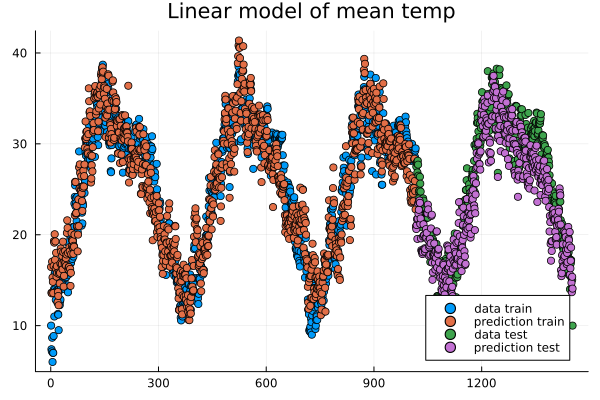

   Linear model predictions.

Airfoil data set
^^^^^^^^^^^^^^^^

Let us now illustrate how to use the package MLJ for non-linear regression. We will use a data set called
*Airfoil Self-Noise* which may be downloaded from the UC Irvine Machine Learning repository `here <http://archive.ics.uci.edu/dataset/291/airfoil+self+noise/>`_.
This is a data set from NASA created by T. Brooks, D. Pope and M. Marcolini obtained from aerodynamic and acoustic tests of airfoil blade sections.

Below we are downloading the data from Rupak Chakraborty's gihub account where UC Irvine data has been collected.
The code example below is an adaptation of the `tutorial <https://juliaai.github.io/DataScienceTutorials.jl/end-to-end/airfoil/>`_ by Ashrya Agrawal.

The fields of this data set are:

  * frequency (Hz),
  * angle of attack (degrees),
  * chord length (m),
  * free-stream velocity (m/s),
  * suction side displacement thickness (m),
  * scaled sound pressure level (db).

We will consider the problem of predicting scaled sound pressure level from the others.

.. code-block:: julia

   using GLM, MLJ
   import MLJDecisionTreeInterface
   import DataFrames
   using CSV
   using HTTP

   path = "https://raw.githubusercontent.com/rupakc/UCI-Data-Analysis/master/"*
   "Airfoil%20Dataset/airfoil_self_noise.dat"

   req = HTTP.get(path);

   df = CSV.read(req.body, DataFrames.DataFrame; header=[
                      "Frequency","Attack_Angle","Chord_Length",
                      "Free_Velocity","Suction_Side","Scaled_Sound"
                      ]
                 );
   y_column = :Scaled_Sound
   X_columns = 1:5

   formula_lin = @formula(Scaled_Sound ~ 1 + Frequency + Attack_Angle + Chord_Length +
   Free_Velocity + Suction_Side)

   train, test = partition(1:size(df, 1), 0.7, shuffle=true)
   df_train = df[train,:]
   df_test = df[test,:]

   model_lin = GLM.fit(LinearModel, formula_lin, df_train)

   X_test = Matrix(df_test[:, X_columns])
   y_test_pred = GLM.predict(model_lin, [ones(size(df_test, 1)) X_test])

   y_test = df_test[:, y_column]
   rmse_lin = rms(y_test, y_test_pred)

   # non-linear model

   X = df[:, X_columns]
   y = df[:,y_column]
   # X = MLJ.transform(MLJ.fit!(machine(Standardizer(), X)), X)
   train, test = partition(eachindex(y), 0.7, shuffle=true)

   model_class = @load DecisionTreeRegressor pkg=DecisionTree
   # model_class = @load RandomForestRegressor pkg=DecisionTree

   model = model_class()
   mach = machine(model, X, y)
   MLJ.fit!(mach, rows=train)
   pred_test = MLJ.predict(mach, rows=test)

   rmse_nlin = rms(pred_test, y[test])

   # Non-linear model is significantly better than linear model.
   println()
   println("rmse linear $rmse_lin")
   println("rmse non-linear $rmse_nlin")
   println()

   # get more model suggestions by changing type of frequency
   # coerce!(X, :Frequency=>Continuous)

   # get model suggestions
   # for model in models(matching(X, y))
   #     print("Model Name: " , model.name , " , Package: " , model.package_name , "\n")
   # end

.. code-block:: text

   rmse linear 5.003216839003985
   rmse non-linear 2.9503907573431922

Simple regression example
^^^^^^^^^^^^^^^^^^^^^^^^^

To illustrate more usages of MLJ and various regression models consider the following simple example.

.. code-block:: julia

   using MLJ, DataFrames
   import MLJDecisionTreeInterface
   import MLJScikitLearnInterface
   using Plots

   Npoints = 200
   noise_level = 0.1
   train_frac = 0.7

   X = range(-6, 6, length=Npoints)
   y = cos.(X) .+ cos.(2*X) .+ 0.01*X.^3
   y = y .+ noise_level*randn(Npoints,)

   X = DataFrame(cX=X)

   train, test = MLJ.partition(eachindex(y), train_frac, shuffle=true);

   # model_class = @load DecisionTreeRegressor pkg=DecisionTree
   # model_class = @load RandomForestRegressor pkg=DecisionTree
   model_class = @load GaussianProcessRegressor pkg=MLJScikitLearnInterface

   model = model_class()
   mach = machine(model, X, y)
   MLJ.fit!(mach, rows=train)

   pred_all = MLJ.predict(mach)

   pred_train = MLJ.predict(mach, rows=train)
   # prediction error train
   err_train = rms(pred_train, y[train])

   pred_test = MLJ.predict(mach, rows=test)
   # prediction error test
   err_test = rms(pred_test, y[test])

   plt = plot(X.cX, pred_all, label="prediction", title="Simple regression test")
   scatter!(X.cX[train], y[train], label="train", markersize=3)
   scatter!(X.cX[test], y[test], label="test", markersize=3)
   display(plt)

   # print models that can be used to model the data
   # for model in models(matching(X, y))
   #     print("Model Name: " , model.name , " , Package: " , model.package_name , "\n")
   # end

   # print root mean square errors of predictions
   println()
   println("rmse non-linear train $err_train")
   println("rmse non-linear test $err_test")
   println()

   # expect output something like
   # rmse non-linear train 0.086
   # rmse non-linear test 0.1311

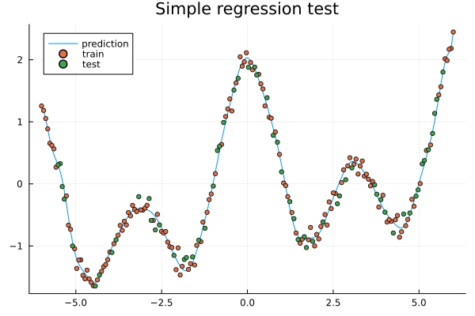

Exercises
---------

.. exercise::

   In the exercises below we use some packages which may be intalled as follows
   if needed.

   .. code-block:: julia

      using Pkg
      Pkg.add("DataFrames")
      Pkg.add("MLJ")
      Pkg.add("MLJDecisionTreeInterface")
      Pkg.add("MLJScikitLearnInterface")
      Pkg.add("Plots")

.. exercise:: Simple regression 1a

   Run the code in the `Simple regression example`_ above and see what prediction errors you get.
   Look through the code and think about what the various steps do.

.. exercise:: Simple regression 1b

   In the `Simple regression example`_ above, what happens if you let the data be partitioned in train and test data without shuffling? You can do this by changing the following line:

   .. code-block:: julia

      # train, test = MLJ.partition(eachindex(y), train_frac, shuffle=true);
      train, test = MLJ.partition(eachindex(y), train_frac, shuffle=false);

   Try the different models (Gaussian process, Decision tree, Random forest), how do they perform on the test data in case of shuffling and non-shuffling?

.. exercise:: Simple regression 2a

   In the `Simple regression example`_, experiment with the settings to change the sampling frequency,
   level of noise imposed on the data and fraction of the data that is used for training
   (the rest is used for testing).

   .. solution:: Change parameters
   
      You can change the following parameters.

      .. code-block:: julia

         Npoints = 200
         noise_level = 0.1
         train_frac = 0.7

.. exercise:: Simple regression 2b

   In the `Simple regression example`_, reset the settings:

   .. code-block:: julia

      Npoints = 200
      noise_level = 0.1
      train_frac = 0.7

   - What happens to the errors and the prediction (blue curve in the plot) when you decrease the training fraction to 0.3, 0.2 or 0.1?
   - Now what happens if you increase the number of points?
   - Can you explain the results?

   .. solution:: Change training fraction

      It seems like the prediction gets really bad when the training fraction is below 0.2 but if we add more points
      we have enough training data to get a good predicition.

.. exercise:: Simple regression 3

   In the `Simple regression example`_, make your own synthetic data set and try it out in the script. The performance will depend a lot on the data and the model.

   .. solution:: Change function

      .. code-block:: julia

         # replace
         # y = cos.(X) .+ cos.(2*X) .+ 0.01*X.^3

         # with your own function, for example
         y = cos.(X) .+ sin.(2*X).^2 .+ 0.01*X.^3

.. exercise:: Simple regression 4

   Try some other models to train on the data from the `Simple regression example`_.
   To see a list of available models one can outcomment the following lines.

   .. code-block:: julia

      # print models that can be used to model the data
      for model in models(matching(X, y))
          print("Model Name: " , model.name , " , Package: " , model.package_name , "\n")
      end

   .. solution:: Change model class

      You can change the model class to one of the models in the previous list.

      .. code-block:: julia

         # replace the model_class
         # model_class = @load GaussianProcessRegressor pkg=MLJScikitLearnInterface
         # with for exmple random forest
         model_class = @load RandomForestRegressor pkg=DecisionTree

         # or a decision tree
         # model_class = @load DecisionTreeRegressor pkg=DecisionTree

      For some models you may have to install the package mentioned and
      an MLJ interface (MLJDecisionTreeInterface, MLJScikitLearnInterface or similar).

      The list of models from above will be something like:

      .. code-block:: text

         Model Name: ARDRegressor , Package: MLJScikitLearnInterface
         Model Name: AdaBoostRegressor , Package: MLJScikitLearnInterface
         Model Name: BaggingRegressor , Package: MLJScikitLearnInterface
         Model Name: BayesianRidgeRegressor , Package: MLJScikitLearnInterface
         Model Name: CatBoostRegressor , Package: CatBoost
         Model Name: ConstantRegressor , Package: MLJModels
         Model Name: DecisionTreeRegressor , Package: BetaML
         Model Name: DecisionTreeRegressor , Package: DecisionTree
         Model Name: DeterministicConstantRegressor , Package: MLJModels
         Model Name: DummyRegressor , Package: MLJScikitLearnInterface
         Model Name: ElasticNetCVRegressor , Package: MLJScikitLearnInterface
         Model Name: ElasticNetRegressor , Package: MLJLinearModels
         Model Name: ElasticNetRegressor , Package: MLJScikitLearnInterface
         Model Name: EpsilonSVR , Package: LIBSVM
         Model Name: EvoLinearRegressor , Package: EvoLinear
         Model Name: EvoSplineRegressor , Package: EvoLinear
         Model Name: EvoTreeGaussian , Package: EvoTrees
         Model Name: EvoTreeMLE , Package: EvoTrees
         Model Name: EvoTreeRegressor , Package: EvoTrees
         Model Name: ExtraTreesRegressor , Package: MLJScikitLearnInterface
         Model Name: GaussianMixtureRegressor , Package: BetaML
         Model Name: GaussianProcessRegressor , Package: MLJScikitLearnInterface
         Model Name: GradientBoostingRegressor , Package: MLJScikitLearnInterface
         Model Name: HistGradientBoostingRegressor , Package: MLJScikitLearnInterface
         Model Name: HuberRegressor , Package: MLJLinearModels
         Model Name: HuberRegressor , Package: MLJScikitLearnInterface
         Model Name: KNNRegressor , Package: NearestNeighborModels
         Model Name: KNeighborsRegressor , Package: MLJScikitLearnInterface
         Model Name: KPLSRegressor , Package: PartialLeastSquaresRegressor
         Model Name: LADRegressor , Package: MLJLinearModels
         Model Name: LGBMRegressor , Package: LightGBM
         Model Name: LarsCVRegressor , Package: MLJScikitLearnInterface
         Model Name: LarsRegressor , Package: MLJScikitLearnInterface
         Model Name: LassoCVRegressor , Package: MLJScikitLearnInterface
         Model Name: LassoLarsCVRegressor , Package: MLJScikitLearnInterface
         Model Name: LassoLarsICRegressor , Package: MLJScikitLearnInterface
         Model Name: LassoLarsRegressor , Package: MLJScikitLearnInterface
         Model Name: LassoRegressor , Package: MLJLinearModels
         Model Name: LassoRegressor , Package: MLJScikitLearnInterface
         Model Name: LinearRegressor , Package: GLM
         Model Name: LinearRegressor , Package: MLJLinearModels
         Model Name: LinearRegressor , Package: MLJScikitLearnInterface
         Model Name: LinearRegressor , Package: MultivariateStats
         Model Name: NeuralNetworkRegressor , Package: BetaML
         Model Name: NeuralNetworkRegressor , Package: MLJFlux
         Model Name: NuSVR , Package: LIBSVM
         Model Name: OrthogonalMatchingPursuitCVRegressor , Package: MLJScikitLearnInterface
         Model Name: OrthogonalMatchingPursuitRegressor , Package: MLJScikitLearnInterface
         Model Name: PLSRegressor , Package: PartialLeastSquaresRegressor
         Model Name: PartLS , Package: PartitionedLS
         Model Name: PartLS , Package: PartitionedLS
         Model Name: PassiveAggressiveRegressor , Package: MLJScikitLearnInterface
         Model Name: QuantileRegressor , Package: MLJLinearModels
         Model Name: RANSACRegressor , Package: MLJScikitLearnInterface
         Model Name: QuantileRegressor , Package: MLJLinearModels
         Model Name: RANSACRegressor , Package: MLJScikitLearnInterface
         Model Name: RANSACRegressor , Package: MLJScikitLearnInterface
         Model Name: RandomForestRegressor , Package: BetaML
         Model Name: RandomForestRegressor , Package: DecisionTree
         Model Name: RandomForestRegressor , Package: DecisionTree
         Model Name: RandomForestRegressor , Package: MLJScikitLearnInterface
         Model Name: RandomForestRegressor , Package: MLJScikitLearnInterface
         Model Name: RidgeCVRegressor , Package: MLJScikitLearnInterface
         Model Name: RidgeCVRegressor , Package: MLJScikitLearnInterface
         Model Name: RidgeRegressor , Package: MLJLinearModels
         Model Name: RidgeRegressor , Package: MLJScikitLearnInterface
         Model Name: RidgeRegressor , Package: MultivariateStats
         Model Name: RobustRegressor , Package: MLJLinearModels
         Model Name: SGDRegressor , Package: MLJScikitLearnInterface
         Model Name: SRRegressor , Package: SymbolicRegression
         Model Name: SVMLinearRegressor , Package: MLJScikitLearnInterface
         Model Name: SVMNuRegressor , Package: MLJScikitLearnInterface
         Model Name: SVMRegressor , Package: MLJScikitLearnInterface
         Model Name: StableForestRegressor , Package: SIRUS
         Model Name: RidgeRegressor , Package: MLJLinearModels
         Model Name: RidgeRegressor , Package: MLJScikitLearnInterface
         Model Name: RidgeRegressor , Package: MultivariateStats
         Model Name: RobustRegressor , Package: MLJLinearModels
         Model Name: SGDRegressor , Package: MLJScikitLearnInterface
         Model Name: SRRegressor , Package: SymbolicRegression
         Model Name: SVMLinearRegressor , Package: MLJScikitLearnInterface
         Model Name: SVMNuRegressor , Package: MLJScikitLearnInterface
         Model Name: SVMRegressor , Package: MLJScikitLearnInterface
         Model Name: StableForestRegressor , Package: SIRUS
         Model Name: SGDRegressor , Package: MLJScikitLearnInterface
         Model Name: SRRegressor , Package: SymbolicRegression
         Model Name: SVMLinearRegressor , Package: MLJScikitLearnInterface
         Model Name: SVMNuRegressor , Package: MLJScikitLearnInterface
         Model Name: SVMRegressor , Package: MLJScikitLearnInterface
         Model Name: StableForestRegressor , Package: SIRUS
         Model Name: SRRegressor , Package: SymbolicRegression
         Model Name: SVMLinearRegressor , Package: MLJScikitLearnInterface
         Model Name: SVMNuRegressor , Package: MLJScikitLearnInterface
         Model Name: SVMRegressor , Package: MLJScikitLearnInterface
         Model Name: StableForestRegressor , Package: SIRUS
         Model Name: SVMLinearRegressor , Package: MLJScikitLearnInterface
         Model Name: SVMNuRegressor , Package: MLJScikitLearnInterface
         Model Name: SVMRegressor , Package: MLJScikitLearnInterface
         Model Name: StableForestRegressor , Package: SIRUS
         Model Name: SVMNuRegressor , Package: MLJScikitLearnInterface
         Model Name: SVMRegressor , Package: MLJScikitLearnInterface
         Model Name: StableForestRegressor , Package: SIRUS
         Model Name: SVMRegressor , Package: MLJScikitLearnInterface
         Model Name: StableForestRegressor , Package: SIRUS
         Model Name: StableForestRegressor , Package: SIRUS
         Model Name: StableRulesRegressor , Package: SIRUS
         Model Name: TheilSenRegressor , Package: MLJScikitLearnInterface
         Model Name: XGBoostRegressor , Package: XGBoost

.. exercise:: Simple regression 5

   In the `Simple regression example`_, try the
   `decision tree <https://en.wikipedia.org/wiki/Decision_tree_learning>`_ model:

   .. code-block:: julia

      # replace the model_class
      # model_class = @load GaussianProcessRegressor pkg=ScikitLearn
      # with for exmple random forest
      model_class = @load DecisionTreeRegressor pkg=DecisionTree

   Note the locally constant (step wise) behavior of the prediction.
   What happens to the prediction curve if you increase the number of data points?

   When you increase the number of points the prediction curve may be hard see because
   of all the plotted points and you can comment out the lines plotting the points:

   .. code-block:: julia

      # scatter!(X.cX[train], y[train], label="train", markersize=3)
      # scatter!(X.cX[test], y[test], label="test", markersize=3)

.. exercise:: Air foil continued

   Return to the `Airfoil data set`_ example above and run the code for it.
   To run the airfoil example you need the packages GLM, MLJ,
   MLJDecisionTreeInterface, DataFrames, CSV and HTTP.

   Try some different models to model the data. You can list available models as follows at the end of the script.
   For some models you may have to install the package mentioned and an MLJ interface
   (MLJDecisionTreeInterface, MLJScikitLearnInterface or similar).

   .. code-block:: julia

      for model in models(matching(X, y))
          print("Model Name: " , model.name , " , Package: " , model.package_name , "\n")
      end

      # get more model suggestions by changing type of the Frequency field from Int64 to Float64
      coerce!(X, :Frequency=>Continuous)

      for model in models(matching(X, y))
          print("Model Name: " , model.name , " , Package: " , model.package_name , "\n")
      end

Some Fourier based models (extra material)
------------------------------------------

In the exercises above you fitted trigometric basis functions to data using a linear model.

.. code-block:: julia

   using Plots, GLM, DataFrames

   # try a cosine combination
   X = range(-6, 6, length=100)
   y = cos.(X) .+ cos.(2*X)
   y_noisy = y .+ 0.1*randn(100,)

   plt = plot(X, y, label="waveform")
   plot!(X, y_noisy, seriestype=:scatter, label="data")

   display(plt)

   df = DataFrame(X=X, y=y_noisy)

   lm1 = lm(@formula(y ~ 1 + cos(X) + cos(2*X) + cos(3*X) + cos(4*X)), df)

.. code-block:: text

   StatsModels.TableRegressionModel{LinearModel{GLM.LmResp{Vector{Float64}}, GLM.DensePredChol{Float64, LinearAlgebra.CholeskyPivoted{Float64, Matrix{Float64}, Vector{Int64}}}}, Matrix{Float64}}

   y ~ 1 + :(cos(X)) + :(cos(2X)) + :(cos(3X)) + :(cos(4X))

   Coefficients:
   ────────────────────────────────────────────────────────────────────────────
                     Coef.  Std. Error      t  Pr(>|t|)    Lower 95%  Upper 95%
   ────────────────────────────────────────────────────────────────────────────
   (Intercept)   0.0130408   0.0108222   1.21    0.2312  -0.00844393  0.0345256
   cos(X)        0.981561    0.015653   62.71    <1e-78   0.950486    1.01264
   cos(2X)       0.984984    0.0156219  63.05    <1e-78   0.953971    1.016
   cos(3X)      -0.0135547   0.015573   -0.87    0.3863  -0.044471    0.0173616
   cos(4X)       0.0148532   0.0155105   0.96    0.3407  -0.015939    0.0456454
   ────────────────────────────────────────────────────────────────────────────

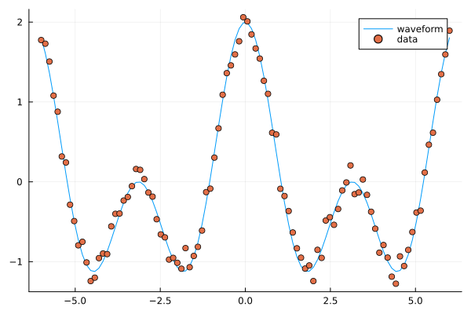

   Fitting trigonometric functions to data.

Note the similarity to Fourier analysis. Let's see how you do the Fourier transform of data using the package FFTW.
We will use data (waveform) similar to that of the last example.

.. code-block:: julia

   using Plots, GLM, DataFrames, FFTW

   L = 100
   Fs = 100
   T = 1/Fs

   X = (0:L-1)*T;
   y = cos.(2*pi*X) .+ cos.(5*2*pi*X)
   y_noisy = y .+ 0.1*randn(L)

   plt = plot(X, y, label="waveform")
   plot!(X, y_noisy, seriestype=:scatter, label="data")

   display(plt)

   df = DataFrame(X1=cos.(2*pi*X), X2=cos.(2*2*pi*X), X3=cos.(3*2*pi*X), X4=cos.(4*2*pi*X),  X5=cos.(5*2*pi*X),  X6=cos.(6*2*pi*X), y=y_noisy)

   lm1 = lm(@formula(y ~ 1 + X1 + X2 + X3 + X4 + X5 + X6), df)

   display(lm1)

   # use function fft (Fast Fourier Transform)
   y_fft = fft(y_noisy)

   # some housekeeping
   P2 = abs.(y_fft/L)
   P1 = P2[1:Int(L/2)+1]
   P1[2:end-1] = 2*P1[2:end-1]

   f = (Fs/L)*(0:Int(L/2))

   plt = plot(f, P1, label="freqs")
   # zooming in a bit on the frequency graph
   # plt = plot(f, P1, label="freqs", xlims=(0,10), xticks = 0:10)

   display(plt)

.. code-block:: text

   StatsModels.TableRegressionModel{LinearModel{GLM.LmResp{Vector{Float64}}, GLM.DensePredChol{Float64, LinearAlgebra.CholeskyPivoted{Float64, Matrix{Float64}, Vector{Int64}}}}, Matrix{Float64}}

   y ~ 1 + X1 + X2 + X3 + X4 + X5 + X6

   Coefficients:
   ──────────────────────────────────────────────────────────────────────────────
                      Coef.  Std. Error      t  Pr(>|t|)   Lower 95%    Upper 95%
   ──────────────────────────────────────────────────────────────────────────────
   (Intercept)   0.00221541   0.0102879   0.22    0.8300  -0.0182143   0.0226451
   X1            0.999929     0.0145493  68.73    <1e-80   0.971037    1.02882
   X2           -0.00803306   0.0145493  -0.55    0.5822  -0.036925    0.0208589
   X3           -0.0319954    0.0145493  -2.20    0.0304  -0.0608874  -0.00310339
   X4           -0.0288931    0.0145493  -1.99    0.0500  -0.0577851  -1.16669e-6
   X5            1.01005      0.0145493  69.42    <1e-81   0.981157    1.03894
   X6            0.00464845   0.0145493   0.32    0.7501  -0.0242435   0.0335404
   ──────────────────────────────────────────────────────────────────────────────

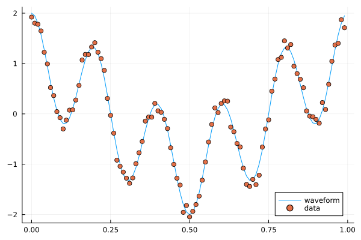

   A combination of cosines with noise.

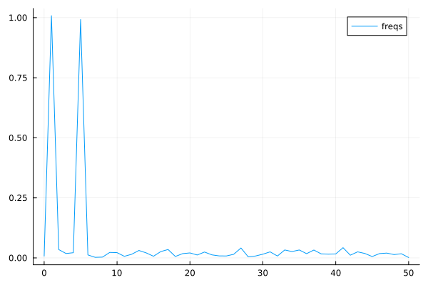

   The Fourier coeffients from FFT, the frequencies are 1 and 5.

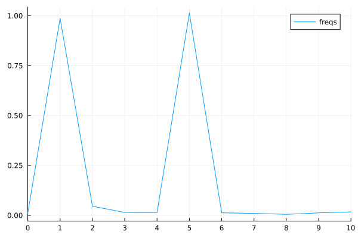

   Zooming in a bit on the frequency graph.

Since the climate data explored above is periodic we may attempt a simple model based on Fourier transforms. To have a cleaner presentation we aggregate the data over each month.

.. code-block:: julia

   using DataFrames, CSV, DataFrames, Plots, Statistics, Dates, GLM, StatsBase

   # data_path = <path-to-data-file>
   # a string, full path to data file DailyDelhiClimateTrain.csv
   df_train = CSV.read(data_path, DataFrame)

   # clean up data
   df_train[:,:meanpressure] = [ abs(x-1000) < 50 ? x : mean(df_train.meanpressure) for x in df_train.meanpressure]

   # add year and month fields
   df_train[:,:year] = Float64.(year.(df_train[:,:date]))
   df_train[:,:month] = Float64.(month.(df_train[:,:date]))

   df_train_m = combine(groupby(df_train, [:year, :month]), :meantemp => mean, :humidity => mean,
   :wind_speed => mean, :meanpressure => mean)

   M_m = [df_train_m.meantemp_mean df_train_m.humidity_mean df_train_m.wind_speed_mean df_train_m.meanpressure_mean]

   plottitles = ["meantemp" "meanhumidity" "meanwindspeed" "meanpressure"]
   plotylabels =  ["C°" "g/m^3?" "km/h?" "hPa"]
   plt = scatter(M_m, layout=(4,1), color=[1 2 3 4], legend=false, title=plottitles, xlabel="time (months)", ylabel=plotylabels, size=(800,800))

   display(plt)

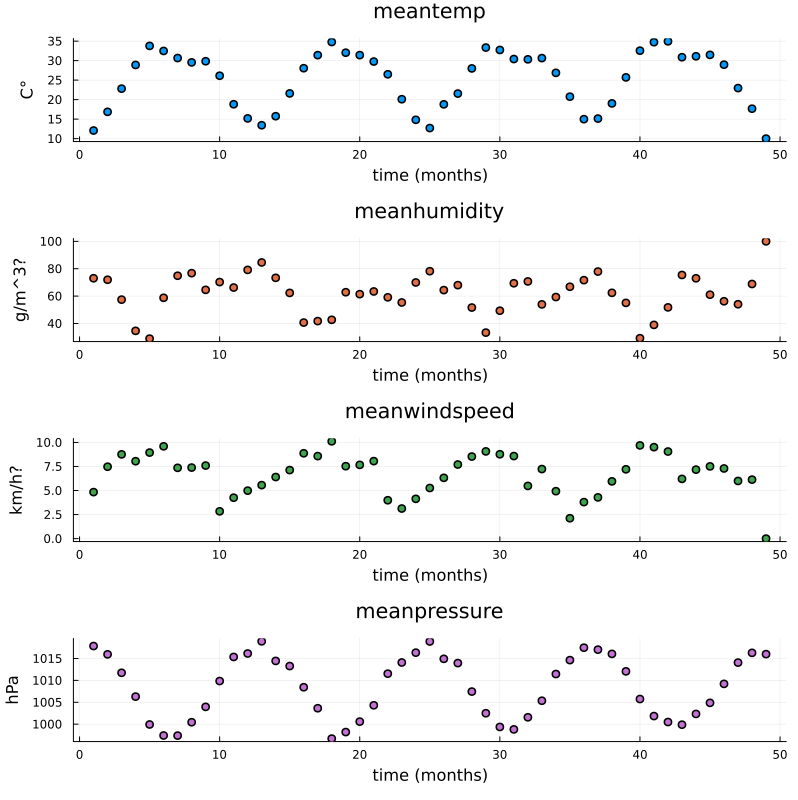

   Aggregated data, mean value for each month.

Now, the Fourier transform gives us the frequency components of the signals. Let us take the mean temperature as an example.

.. code-block:: julia

   using FFTW

   # just to have even number of samples for simplicity
   df_train_m = df_train_m[2:end,:]

   # normalize for better exposition of frequencies
   the_mean = mean(df_train_m.meantemp_mean)
   y = df_train_m.meantemp_mean .- the_mean

   L = size(df_train_m)[1]
   Fs = 1
   T = 1/Fs

   y_fft = fft(y)
   P2 = abs.(y_fft/L)
   P1 = P2[1:Int(L/2)+1]
   P1[2:end-1] = 2*P1[2:end-1]

   f = (Fs/L)*(0:Int(L/2))

   plt = plot(f, P1, label="freqs")

   display(plt)

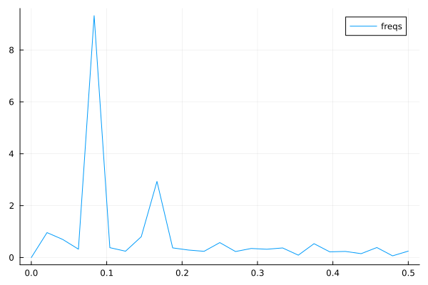

   Plots of frequency content of temperature data. There is a peak at roughly 1/12 corresonding to a period of 1 year.

We use the frequency information for interpolation and extrapolation and thereby build a model of the data.
To decrease overfitting, we may project to a lower dimensional subspace of basis functions (essentially trigonmetric functions) by setting a limit parameter proj_lim below.

.. code-block:: julia

   # up sample function to finer grid (interpolation)
   upsample = 2
   L_u = floor(Int64, L*upsample)
   t_u = (0:L_u-1)*L/L_u

   # set limit for projection
   # proj_lim 0 means no projection
   function get_model(proj_lim)

     y_fft_tmp = y_fft.*[ abs(x) < proj_lim*L ? 0.0 : 1.0 for x in y_fft]

     # center frequencies on constant component (zero frequency)
     y_fft_shift = fftshift(y_fft_tmp)

     # fill in zeros (padding) for higher frequencies for upsampling
     npad = floor(Int64, L_u/2 - L/2)

     y_fft_pad = [zeros(npad); y_fft_shift; zeros(npad)]

     # up sampling by applying inverse Fourier transform to paddded frequency vector
     # same as interpolating using linear combination of trignometric functions
     pred = real(ifft(fftshift(y_fft_pad)))*L_u/L

     # ifft(fftshift(y_fft_pad))

     pred = pred .+ the_mean

   end

   pred0 = get_model(0.0)
   pred1 = get_model(1.0)
   pred2 = get_model(2.0)

   y = y .+ the_mean

   t = (0:L-1)
   plt = scatter([t t t], [y y y], layout=(3,1), label=["data" "data" "data"])
   plot!([t_u t_u t_u], [pred2 pred1 pred0], layout=(3,1), label=["model crude" "model fine" "model overfit"], title=["meantemp crude (limit 2)" "meantemp fine (limit 1)" "meantemp overfit (limit 0)"], xlabel="time (months)", ylabel="C°", size=(800,800))

   display(plt)

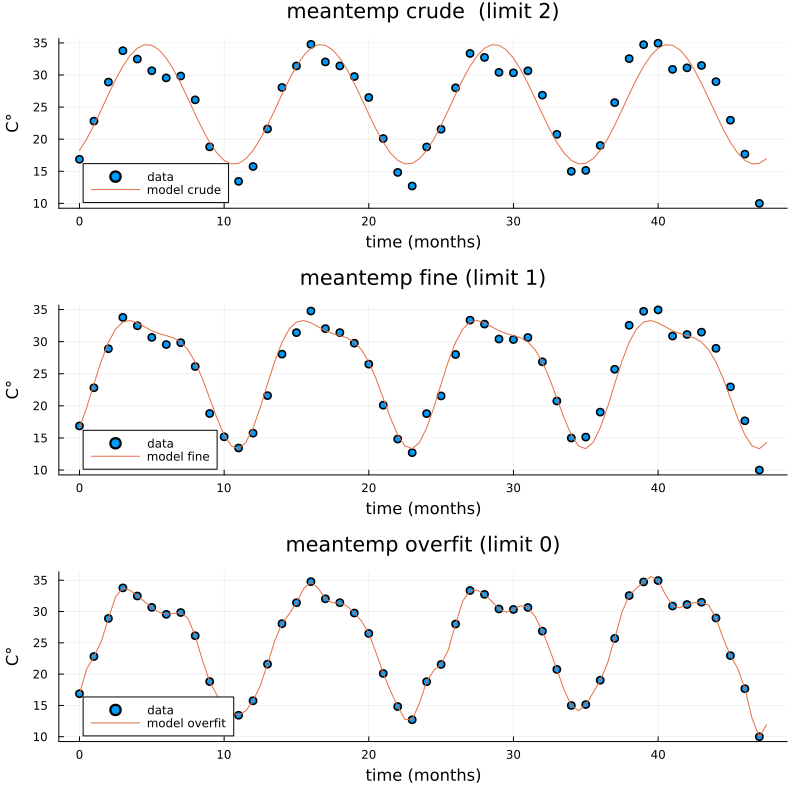

   Three models of varying crudeness and overfit.

