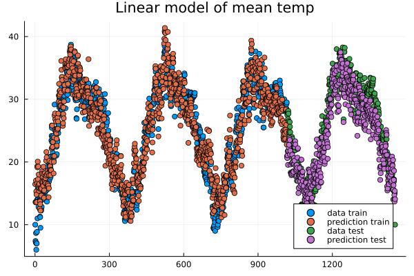

.. _regression:

Regression, time-series prediction and analysis
================================================

.. questions::

   - How can I perform regression in Julia?
   - How can I perform time-series analysis and prediciton in Julia?

.. instructor-note::

   - 120 min teaching
   - 60 min exercises

Linear regression with synthetic data
-------------------------------------

We begin with some simple examples of linear regression on generated data. For the models we will use the package GLM (Generlized Linear Models).

.. code-block:: julia

   using Plots, GLM, DataFrames

   X = Vector(range(0, 10, length=20))
   y = 5*X .+ 3.4
   y_noisy = @. 5*X + 3.4 + randn()

   plt = plot(X, y, label="linear")
   plot!(X, y_noisy, seriestype=:scatter, label="data")

   display(plt)

.. code-block:: julia

   df = DataFrame(cX=X, cy=y_noisy)
   lm1 = fit(LinearModel, @formula(cy ~ cX), df)

   # the above is the same as @formula(cy ~ cX + 1), which also works

   # alternative syntax
   # lm(@formula(cy ~ cX), df)
   # glm(@formula(cy ~ cX), df, Normal(), IdentityLink())
   # lm(@formula(cy ~ cX), df)

.. code-block:: text

   StatsModels.TableRegressionModel{LinearModel{GLM.LmResp{Vector{Float64}}, GLM.DensePredChol{Float64, LinearAlgebra.CholeskyPivoted{Float64, Matrix{Float64}, Vector{Int64}}}}, Matrix{Float64}}

   cy ~ 1 + cX # the constant term (intercept) is there, same as if we do @formula(cy ~ cX + 1)

   Coefficients:
   ───────────────────────────────────────────────────────────────────────
                  Coef.  Std. Error      t  Pr(>|t|)  Lower 95%  Upper 95%
   ───────────────────────────────────────────────────────────────────────
   Intercept)  3.46467   0.448322    7.73    <1e-06    2.52278    4.40656
   cX           5.05127   0.0766497  65.90    <1e-22    4.89024    5.21231
   ───────────────────────────────────────────────────────────────────────

.. code-block:: julia

   # note the order in the formula argument
   fit(LinearModel, @formula(cX ~ cy), df) # this would model line with slope 1/5 and intercept -3.4/5

Plotting the result.

.. code-block:: julia

   y_pred = predict(lm1)

   # alternative: do it explicitly
   # coeffs = coeftable(lm1).cols[1] # intercept and slope
   # y_pred = coeffs[1] .+ coeffs[2]*X

   plot!(X, y_pred, label="predicted")

   display(plt)

.. figure:: img/linear_synth_2.png
   :align: center

   Image of linear model prediction. The example shown has intercept 2.9 and slope 5.1 (the result depends on random added noise).

Multivariate linear models are very similar.

.. code-block:: julia

   using Plots, GLM, DataFrames

   n = 4
   C = randn(n+1,1)
   X = rand(100,n)

   y = X*C[2:end] .+ C[1]
   y_noisy = y .+ 0.01*randn(100,1)

   df = DataFrame(cX1=X[:,1], cX2=X[:,2], cX3=X[:,3], cX4=X[:,4], cy=y_noisy[:,1])

   lm2 = lm(@formula(cy ~ cX1+cX2+cX3+cX4), df)

   println(lm2)
   println()
   print(C)

.. code-block:: text

   cy ~ 1 + cX1 + cX2 + cX3 + cX4

   Coefficients:
   ───────────────────────────────────────────────────────────────────────────
                    Coef.  Std. Error        t  Pr(>|t|)  Lower 95%  Upper 95%
   ───────────────────────────────────────────────────────────────────────────
   (Intercept)  -1.02879   0.0035902   -286.55    <1e-99  -1.03592   -1.02166
   cX1          -0.935462  0.0034155   -273.89    <1e-99  -0.942242  -0.928681
   cX2           0.183037  0.00345387    52.99    <1e-71   0.17618    0.189894
   cX3          -0.737696  0.00390208  -189.05    <1e-99  -0.745443  -0.729949
   cX4          -1.59192   0.00327437  -486.18    <1e-99  -1.59842   -1.58542
   ───────────────────────────────────────────────────────────────────────────

   [-1.022984643687018; -0.9366244594383493; 0.18095529608948402; -0.7396860440808664; -1.595858344253308;;]

It is straight forward to incorporate linear models with basis functions, that is to model a function as a linear combination of given functions such polynomials or trigonometric functions.

.. code-block:: julia

   using Plots, GLM, DataFrames

   # try this polynomial
   X = range(-6, 6, length=40)
   y = X.^5 .- 34*X.^3 .+ 225*X
   y_noisy = y .+ randn(40,)

   # model sensitive to noise
   # if more noise, need more points (keep noise down for clarity in graph)

   plt = plot(X, y, label="polynomial")
   plot!(X, y_noisy, seriestype=:scatter, label="data")

   display(plt)

   df = DataFrame(cX=X, cy=y_noisy)

   lm1 = lm(@formula(cy ~ cX^5 + cX^4 + cX^3 + cX^2 + cX + 1), df)

.. code-block:: text

   StatsModels.TableRegressionModel{LinearModel{GLM.LmResp{Vector{Float64}}, GLM.DensePredChol{Float64, LinearAlgebra.CholeskyPivoted{Float64, Matrix{Float64}, Vector{Int64}}}}, Matrix{Float64}}

   cy ~ 1 + :(cX ^ 5) + :(cX ^ 4) + :(cX ^ 3) + :(cX ^ 2) + cX

   Coefficients:
   ───────────────────────────────────────────────────────────────────────────────────────
                        Coef.   Std. Error         t  Pr(>|t|)     Lower 95%     Upper 95%
   ───────────────────────────────────────────────────────────────────────────────────────
   (Intercept)   -0.0354375    0.343821        -0.10    0.9185   -0.734166      0.663291
   cX ^ 5         1.00118      0.000551333   1815.92    <1e-85    1.00006       1.0023
   cX ^ 4        -0.000992084  0.00169158      -0.59    0.5614   -0.00442979    0.00244563
   cX ^ 3       -34.054        0.0236797    -1438.11    <1e-82  -34.1021      -34.0058
   cX ^ 2         0.0230557    0.0571179        0.40    0.6890   -0.0930219     0.139133
   cX           225.511        0.226822       994.22    <1e-76  225.05        225.972
   ───────────────────────────────────────────────────────────────────────────────────────

.. figure:: img/linear_basis_1.png
   :align: center

   Fitting a polynomial to data.

.. code-block:: julia

   # try a cosine combination
   X = range(-6, 6, length=100)
   y = cos.(X) .+ cos.(2*X)
   y_noisy = y .+ 0.1*randn(100,)

   plt = plot(X, y, label="waveform")
   plot!(X, y_noisy, seriestype=:scatter, label="data")

   display(plt)

   df = DataFrame(X=X, y=y_noisy)

   lm1 = lm(@formula(y ~ 1 + cos(X) + cos(2*X) + cos(3*X) + cos(4*X)), df)

.. code-block:: text

   StatsModels.TableRegressionModel{LinearModel{GLM.LmResp{Vector{Float64}}, GLM.DensePredChol{Float64, LinearAlgebra.CholeskyPivoted{Float64, Matrix{Float64}, Vector{Int64}}}}, Matrix{Float64}}

   y ~ 1 + :(cos(X)) + :(cos(2X)) + :(cos(3X)) + :(cos(4X))

   Coefficients:
   ────────────────────────────────────────────────────────────────────────────
                     Coef.  Std. Error      t  Pr(>|t|)    Lower 95%  Upper 95%
   ────────────────────────────────────────────────────────────────────────────
   (Intercept)   0.0130408   0.0108222   1.21    0.2312  -0.00844393  0.0345256
   cos(X)        0.981561    0.015653   62.71    <1e-78   0.950486    1.01264
   cos(2X)       0.984984    0.0156219  63.05    <1e-78   0.953971    1.016
   cos(3X)      -0.0135547   0.015573   -0.87    0.3863  -0.044471    0.0173616
   cos(4X)       0.0148532   0.0155105   0.96    0.3407  -0.015939    0.0456454
   ────────────────────────────────────────────────────────────────────────────

.. figure:: img/linear_basis_2.png
   :align: center

   Fitting trigonomtric functions to data.

Note the similarity to Fourier analysis. Let's see how you do the Fourier transform of data using the package FFTW.
We will use data (waveform) similar to that of the last example.

.. code-block:: julia

   using Plots, GLM, DataFrames, FFTW

   L = 100
   Fs = 100
   T = 1/Fs

   X = (0:L-1)*T;
   y = cos.(2*pi*X) .+ cos.(5*2*pi*X)
   y_noisy = y .+ 0.1*randn(L)

   plt = plot(X, y, label="waveform")
   plot!(X, y_noisy, seriestype=:scatter, label="data")

   display(plt)

   df = DataFrame(X1=cos.(2*pi*X), X2=cos.(2*2*pi*X), X3=cos.(3*2*pi*X), X4=cos.(4*2*pi*X),  X5=cos.(5*2*pi*X),  X6=cos.(6*2*pi*X), y=y_noisy)

   lm1 = lm(@formula(y ~ 1 + X1 + X2 + X3 + X4 + X5 + X6), df)

   print(lm1)

   # use function fft (Fast Fourier Transform)
   y_fft = fft(y_noisy)
   
   # some housekeeping
   P2 = abs.(y_fft/L)
   P1 = P2[1:Int(L/2)+1]
   P1[2:end-1] = 2*P1[2:end-1]

   f = (Fs/L)*(0:Int(L/2))

   plt = plot(f, P1, label="freqs")

   display(plt)

.. code-block:: text

   StatsModels.TableRegressionModel{LinearModel{GLM.LmResp{Vector{Float64}}, GLM.DensePredChol{Float64, LinearAlgebra.CholeskyPivoted{Float64, Matrix{Float64}, Vector{Int64}}}}, Matrix{Float64}}

   y ~ 1 + X1 + X2 + X3 + X4 + X5 + X6

   Coefficients:
   ──────────────────────────────────────────────────────────────────────────────
                      Coef.  Std. Error      t  Pr(>|t|)   Lower 95%    Upper 95%
   ──────────────────────────────────────────────────────────────────────────────
   (Intercept)   0.00221541   0.0102879   0.22    0.8300  -0.0182143   0.0226451
   X1            0.999929     0.0145493  68.73    <1e-80   0.971037    1.02882
   X2           -0.00803306   0.0145493  -0.55    0.5822  -0.036925    0.0208589
   X3           -0.0319954    0.0145493  -2.20    0.0304  -0.0608874  -0.00310339
   X4           -0.0288931    0.0145493  -1.99    0.0500  -0.0577851  -1.16669e-6
   X5            1.01005      0.0145493  69.42    <1e-81   0.981157    1.03894
   X6            0.00464845   0.0145493   0.32    0.7501  -0.0242435   0.0335404
   ──────────────────────────────────────────────────────────────────────────────

   A combination of cosines with noise.

.. figure:: img/linear_freqs.png
   :align: center

   The Fourier coeffients from FFT, the frequencies are 1 and 5.

Linear regression on real data
------------------------------

Let us illustrate linear regression on real data sets.

The first dataset comes from the RDatasets package and are data from chemical experiments for the production of formeldyhyde. The data columns are ammount of Carbohydrate (ml) and Optical Density of a purple color on a spectrophotometer.

Sources: Bennett, N. A. and N. L. Franklin (1954) Statistical Analysis in Chemistry and the Chemical Industry. New York: Wiley and McNeil, D. R. (1977) Interactive Data Analysis. New York: Wiley.

.. code-block:: julia

   using GLM, RDatasets, Plots

   df = dataset("datasets", "Formaldehyde")

   plt = plot(df.Carb, df.OptDen, seriestype=:scatter, label="formaldehyde data")
   display(plt)

   model = fit(LinearModel, @formula(OptDen ~ Carb), df)

   y_pred = predict(model)

   plot!(df.Carb, y_pred, label="model")

   display(plt)

.. figure:: img/linear_formaldehyde.png
   :align: center

The second dataset we will use comes from the Rdatasets package and consists of measurements on black cherry trees: girth, height and volume (see Atkinson, A. C. (1985) Plots, Transformations and Regression. Oxford University Press).).

.. code-block:: julia

   using GLM, RDatasets, StatsBase, Plots

   # Girth Height and Volume of Black Cherry Trees
   trees = dataset("datasets", "trees")
   df = trees

   n_rows = size(df)[1]
   rows_train = sample(1:n_rows, Int(round(n_rows*0.8)), replace=false)
   rows_test = [x for x in 1:n_rows if ~(x in rows_train)]

   L_train = df[rows_train,:]
   L_test = df[rows_test,:]

   # reasonable to look at logarithms since can expect something like V~h*r^2 and
   # log V = constant + log h + 2log r
   model = fit(LinearModel, @formula(log(Volume) ~ log(Girth) + log(Height)), L_train)

   Z = L_train
   y_pred = predict(model, Z)

   # Root Mean Squared Error
   rmse = sqrt(sum((exp.(y_pred) - Z.Volume).^2)/size(Z)[1])

   println(rmse)
   df

.. code-block:: text

   2.2631848027992776 # rmse

   31×3 DataFrame
    Row │ Girth    Height  Volume
        │ Float64  Int64   Float64
   ─────┼──────────────────────────
      1 │     8.3      70     10.3
      2 │     8.6      65     10.3
      3 │     8.8      63     10.2
      4 │    10.5      72     16.4
      5 │    10.7      81     18.8
      6 │    10.8      83     19.7
      7 │    11.0      66     15.6
      8 │    11.0      75     18.2
      9 │    11.1      80     22.6
     10 │    11.2      75     19.9
     11 │    11.3      79     24.2

   And so on (31 data points).

Loading data
------------

We will now have a look at a climate data set containing daily mean
temperature, humidity, wind speed and mean pressure at a location in
Dehli India over a period of several years. In the context of the
Dehli dataset we have borrowed some elements of Sebastian Callh's personal
blog post *Forecasting the weather with neural ODEs* found `here
<https://sebastiancallh.github.io/post/neural-ode-weather-forecast/>`_.

.. code-block:: julia

   using DataFrames, CSV, DataFrames, Plots

   # full path to data files
   # uploaded in julia-for-hpda/content/data
   df_train = CSV.read("C:/Users/username/DailyDelhiClimateTrain.csv", DataFrame)
   df_test = CSV.read("C:/Users/username/DailyDelhiClimateTest.csv", DataFrame)
   df_train

   M = [df_train.meantemp df_train.humidity df_train.wind_speed df_train.meanpressure]
   plottitles = ["meantemp" "humidity" "wind_speed" "meanpressure"]
   plotylabels =  ["C°" "g/m^3" "km/h" "hPa"]
   # color=[1 2 3 4] gives default colors
   plot(M, layout=(4,1), color=[1 2 3 4], legend=false, title=plottitles, xlabel="time (days)", ylabel=plotylabels, size=(800,800))

.. figure:: img/climate_plots_first.png
   :align: center

   Plots of measurements.

The mean pressure data field seems to contain some unreasonably large values. Let us filter those out and consider these missing data.

.. code-block:: julia

   using DataFrames, CSV, DataFrames, Plots

   # full path to data files
   # uploaded in julia-for-hpda/content/data
   df_train = CSV.read("C:/Users/username/DailyDelhiClimateTrain.csv", DataFrame)
   df_test = CSV.read("C:/Users/username/DailyDelhiClimateTest.csv", DataFrame)

   M = [df_train.meantemp df_train.humidity df_train.wind_speed df_train.meanpressure]

   plottitles = ["meantemp" "humidity" "wind_speed" "meanpressure"]
   plotylabels =  ["C°" "g/m^3" "km/h" "hPa"]

   # remove mean pressures above 1050 hPa and below 950 hPa
   pressure_mod = [ abs(x-1000) < 50 ? x : NaN for x in df_train.meanpressure]

   Mmod = [df_train.meantemp df_train.humidity df_train.wind_speed pressure_mod]

   # color=[1 2 3 4] gives default colors
   plt = plot(Mmod, layout=(4,1), color=[1 2 3 4], legend=false, title=plottitles, xlabel="time (days)", ylabel=plotylabels, size=(800,800))

   display(plt)

.. figure:: img/climate_plots_second.png
   :align: center

   Plots of cleaned up data.

Simple Fourier based models
---------------------------

Since the data is periodic we may attempt a simple model based on Fourier transforms. To have a cleaner presentaiton we aggregate the data over each month.

.. code-block:: julia

   # clean up data
   df_train[:,:meanpressure] = [ abs(x-1000) < 50 ? x : mean(df_train.meanpressure) for x in df_train.meanpressure]

   # add year and month fields
   df_train[:,:year] = Float64.(year.(df_train[:,:date]))
   df_train[:,:month] = Float64.(month.(df_train[:,:date]))

   df_test[:,:year] = Float64.(year.(df_test[:,:date]))
   df_test[:,:month] = Float64.(month.(df_test[:,:date]))

   df_train_m = combine(groupby(df_train, [:year, :month]), :meantemp => mean, :humidity => mean,
   :wind_speed => mean, :meanpressure => mean)

   M_m = [df_train_m.meantemp_mean df_train_m.humidity_mean df_train_m.wind_speed_mean df_train_m.meanpressure_mean]
   plt = scatter(M_m, layout=(4,1), color=[1 2 3 4], legend=false, title=plottitles, xlabel="time (months)", ylabel=plotylabels, size=(800,800))

   display(plt)

.. figure:: img/climate_plots_months.png
   :align: center

   Aggregated data, mean value for each month.

Now, the Fourier transform gives us the frequency components of the signals. Let us take the mean temperature as an example.

.. code-block:: julia

   using FFTW

   # just to have even number of samples for simplicity
   df_train_m = df_train_m[2:end,:]

   # normalize for better exposition of frequencies
   the_mean = mean(df_train_m.meantemp_mean)
   y = df_train_m.meantemp_mean .- the_mean

   L = size(df_train_m)[1]
   Fs = 1
   T = 1/Fs

   y_fft = fft(y)
   P2 = abs.(y_fft/L)
   P1 = P2[1:Int(L/2)+1]
   P1[2:end-1] = 2*P1[2:end-1]

   f = (Fs/L)*(0:Int(L/2))

   plt = plot(f, P1, label="freqs")

   display(plt)

   Plots of frequency content of temperature data. There is a peak at roughly 1/12 corresonding to a period of 1 year.

We use the frequency information for interpolation and extrapolation and thereby build a model of the data.
To decrease overfitting, we may project to a lower dimensional subspace of basis functions (essentially trigonmetric functions) by setting a limit parameter proj_lim below.

.. code-block:: julia

   # up sample function to finer grid (interpolation)
   upsample = 2
   L_u = floor(Int64, L*upsample)
   t_u = (0:L_u-1)*L/L_u

   # set limit for projection
   # proj_lim 0 means no projection 
   function get_model(proj_lim)

     y_fft_tmp = y_fft.*[ abs(x) < proj_lim*L ? 0.0 : 1.0 for x in y_fft]

     # center frequencies on constant component (zero frequency)
     y_fft_shift = fftshift(y_fft_tmp)

     # fill in zeros (padding) for higher frequencies for upsampling
     npad = floor(Int64, L_u/2 - L/2)

     y_fft_pad = [zeros(npad); y_fft_shift; zeros(npad)]

     # up sampling by applying inverse Fourier transform to paddded frequency vector
     # same as interpolating using linear combination of trignometric functions
     pred = real(ifft(fftshift(y_fft_pad)))*L_u/L

     # put back constant component
     pred = pred .+ the_mean

   end

   pred0 = get_model(0.0)
   pred1 = get_model(1.0)
   pred2 = get_model(2.0)

   y = y .+ the_mean

   t = (0:L-1)
   plt = scatter([x x x], [y y y], layout=(3,1), label=["data" "data" "data"])
   plot!([t_u t_u t_u], [pred2 pred1 pred0], layout=(3,1), label=["model crude" "model fine" "model overfit"], title=["meantemp crude" "meantemp fine" "meantemp overfit"], xlabel="time (months)", ylabel="C°", size=(800,800))

   display(plt)

.. figure:: img/climate_fft_model.png
   :align: center

   Three models of varying crudeness and overfit.

Non-linear regression
---------------------

In this section we will have a look at non-linear regression methods.

Climate data
^^^^^^^^^^^^

Now we will consider the problem of predicting one of the climate variables from the others, for example temperature from humidity, wind speed and pressure. In the process we will see how to set up and train a neural network in Julia using the package Flux.

.. code-block:: julia

   using DataFrames, CSV, DataFrames, Plots, Statistics, Dates, GLM, Flux, StatsBase
   using MLJ: shuffle, partition
   using Flux: train!

   df = CSV.read("C:/Users/davidek/julia_kurser/DailyDelhiClimateTrain.csv", DataFrame)

   # clean up data
   df[:,:meanpressure] = [ abs(x-1000) < 50 ? x : mean(df.meanpressure) for x in df.meanpressure]

   topredict = "mean temp"
   y = df.meantemp
   X = [(df.humidity .- 50) (df.wind_speed .- 5) (df.meanpressure .- 1000)]

   z = eachindex(y)

   # 70:30 split in training and testing
   # shuffle or straight split
   train, test = partition(z, 0.7, shuffle=false)
   X_train = X[train, :]
   y_train = y[train, :]
   X_test = X[test, :]
   y_test = y[test, :]

   function draw_results(X_train, X_test, y_train, y_test, model)
       y_pred_train = model(X_train')'

       plt = scatter(train, y_train, title="Non-linear model of "*topredict, label="data train")
       scatter!(train, y_pred_train, label="prediction train")

       y_pred_test = model(X_test')'

       scatter!(test, y_test, label="data test")
       scatter!(test, y_pred_test, label="prediction test")

       display(plt)

       rmse_train = sqrt(Flux.Losses.mse(y_train, y_pred_train))
       rmse_test = sqrt(Flux.Losses.mse(y_test, y_pred_test))

       println(topredict)
       println("rmse train: ", rmse_train)
       println("rmse_test: ", rmse_test)
   end

   draw_results_lin(X_train, X_test, y_train, y_test, model_lin)

   init=Flux.glorot_uniform()
   model = Chain(
               Dense(3, 10, tanh, init=init, bias=true),
               # Dense(10, 10, tanh, init=init, bias=true),
               # Dropout(0.04),
               Dense(10, 1, init=init, bias=true)
   )

   ps = Flux.params(model)
   loss(tX, ty) = Flux.Losses.mse(model(tX'), ty')
   opt = ADAM(0.01) # learning rate 0.01

   data = [(X_train, y_train)]
   n_epochs = 1000

   train_loss = []
   test_loss = []

   for epoch in 1:n_epochs
       train!(loss, ps, data, opt)
       ltrain = sqrt(loss(X_train, y_train))
       ltest = sqrt(loss(X_test, y_test))
       push!(train_loss, ltrain)
       push!(test_loss, ltest)
       println("Epoch: $epoch, rmse train/test: ", ltrain, " ", ltest)
   end

   draw_results(X_train, X_test, y_train, y_test, model)

   plt = plot(train_loss, title="Losses (root mean square error)", label="training", xlabel="epochs")
   plot!(test_loss, label="test")
   display(plt)

.. figure:: img/climate_nonlinear_reg.png
   :align: center

   Data points and predictions.

.. figure:: img/climate_reg_losses.png
   :align: center

   The losses during training.

.. code-block:: text

   Epoch: 997, rmse train/test: 2.401997981277437 2.933315445135163
   Epoch: 998, rmse train/test: 2.4018819530994313 2.933265840346145
   Epoch: 999, rmse train/test: 2.40176617679199 2.9332149025558074
   Epoch: 1000, rmse train/test: 2.401650646723321 2.9331655702024872
   mean temp
   rmse train: 2.401650646723321
   rmse_test: 2.9331655702024872

It is interesting to animate the predictions during the training of the neural network. This will also give us a quick look at animation in Julia.

.. code-block:: julia

   # instead of the training loop above
   # do this to save an animation as a gif

   anim = @animate for epoch in 1:n_epochs

       train!(loss, ps, data, opt)
       ltrain = sqrt(loss(X_train, y_train))
       ltest = sqrt(loss(X_test, y_test))
       push!(train_loss, ltrain)
       push!(test_loss, ltest)
       println("Epoch: $epoch, rmse train/test: ", ltrain, " ", ltest)

       y_pred_train = model(X_train')'
       y_pred_test = model(X_test')'

       scatter(train, y_train, title="Non-linear model of "*topredict, label="data train", yrange=[0,40])
       scatter!(train, y_pred_train, label="prediction train")
       scatter!(test, y_test, label="data test")
       scatter!(test, y_pred_test, label="prediction test")

   end every 2 # include every second frame

   gif(anim, "anim_points_training.gif")

   Evolution of prediction during training.

Let us also check how well a linear model is doing in this case. It turns out it is doing almost as good as the non-linear model, and perhaps better at capturing the peaks.

.. code-block:: julia

   using DataFrames, CSV, DataFrames, Plots, Statistics, Dates, GLM, Flux, StatsBase
   using MLJ: shuffle, partition
   using Flux: train!

   df = CSV.read("C:/Users/davidek/julia_kurser/DailyDelhiClimateTrain.csv", DataFrame)

   # clean up data
   df[:,:meanpressure] = [ abs(x-1000) < 50 ? x : mean(df.meanpressure) for x in df.meanpressure]

   topredict = "mean temp"
   y = df.meantemp
   X = [(df.humidity .- 50) (df.wind_speed .- 5) (df.meanpressure .- 1000)]

   z = eachindex(y)

   # 70:30 split in training and testing
   # shuffle or straight split
   train, test = partition(z, 0.7, shuffle=false)
   X_train = X[train, :]
   y_train = y[train, :]
   X_test = X[test, :]
   y_test = y[test, :]

   df_model = DataFrame(cX1=X_train[:,1], cX2=X_train[:,2], cX3=X_train[:,3], cy=y_train[:,1])

   model_lin = lm(@formula(cy ~ 1+cX1+cX2+cX3), df_model)

   function draw_results_lin(X_train, X_test, y_train, y_test, model)
       model = model_lin

       Z_train = [ones(size(X_train,1)) X_train]

       y_pred_train = predict(model, Z_train)
       y_train = y_train[:,1]

       plt = scatter(train, y_train, title="Linear model of "*topredict, label="data train")
       scatter!(train, y_pred_train, label="prediction train")

       Z_test = [ones(size(X_test,1)) X_test]

       y_pred_test = predict(model, Z_test)
       y_test = y_test[:,1]

       scatter!(test, y_test, label="data test")
       scatter!(test, y_pred_test, label="prediction test")

       display(plt)

       rmse_train = sqrt(Flux.Losses.mse(y_train, y_pred_train))
       rmse_test = sqrt(Flux.Losses.mse(y_test, y_pred_test))

       println(topredict)
       println("rmse train: ", rmse_train)
       println("rmse_test: ", rmse_test)
   end

   draw_results_lin(X_train, X_test, y_train, y_test, model_lin)

.. code-block:: text

   mean temp
   rmse train: 2.654280437247272
   rmse_test: 3.1429118309689383

   Linear model predictions.

Airfoil data set
^^^^^^^^^^^^^^^^

Let us now illustrate how to use the package MLJ for non-linear regression. We will use a data set called
*Airfoil Self-Noise* which may be downloaded from the UC Irvine Machine Learning repository `here <http://archive.ics.uci.edu/dataset/291/airfoil+self+noise/>`_.
This is a data set from NASA created by T. Brooks, D. Pope and M. Marcolini obtained from aerodynamic and acoustic tests of airfoil blade sections.

Below we are downloading the data from Rupak Chakraborty's gihub account where UC Irvine data has been collected.
The code example below is an adaptation of the `tutorial <https://juliaai.github.io/DataScienceTutorials.jl/end-to-end/airfoil/>`_ by Ashrya Agrawal.

The fields of this data set are:

  * frequency (Hz),
  * angle of attack (degrees),
  * chord length (m),
  * free-stream velocity (m/s),
  * suction side displacement thickness (m),
  * scaled sound pressure level (db),

and we will consider the problem of predicting scaled sound pressure level from the others.

.. code-block:: julia

   using GLM, RDatasets, MLJ, Flux
   import MLJDecisionTreeInterface
   using BetaML
   using MLJ: shuffle, partition
   import DataFrames
   using CSV
   using HTTP

   req = HTTP.get("https://raw.githubusercontent.com/rupakc/UCI-Data-Analysis/master/Airfoil%20Dataset/airfoil_self_noise.dat");

   df = CSV.read(req.body, DataFrames.DataFrame; header=[
                      "Frequency","Attack_Angle","Chord_Length",
                      "Free_Velocity","Suction_Side","Scaled_Sound"
                      ]
                 );
   y_column = :Scaled_Sound
   X_columns = 1:5
   formula_lin = @formula(Scaled_Sound ~ 1 + Frequency + Attack_Angle + Chord_Length + Free_Velocity + Suction_Side)

   train, test = partition(1:size(df, 1), 0.7, shuffle=true)
   df_train = df[train,:]
   df_test = df[test,:]

   model_lin = GLM.fit(LinearModel, formula_lin, df_train)

   X_test = Matrix(df_test[:, X_columns])

   y_test = df_test[:, y_column]
   y_test_pred = GLM.predict(model_lin, [ones(size(df_test, 1)) X_test])

   rmse_lin = rms(y_test, y_test_pred)

   # non-linear model

   # what does colname -> true do?
   y, X = unpack(df, ==(y_column), colname -> true)
   X = MLJ.transform(MLJ.fit!(machine(Standardizer(), X)), X)
   train, test = partition(collect(eachindex(y)), 0.7, shuffle=true);

   model_class = @load DecisionTreeRegressor pkg=DecisionTree
   model = model_class()
   mach = machine(model, X, y)
   MLJ.fit!(mach, rows=train)
   pred_test = MLJ.predict(mach, rows=test)

   rmse_nlin = rms(pred_test, y[test])

   # Non-linear model is significantly better than linear model.
   println()
   println("rmse linear $rmse_lin")
   println("rmse non-linear $rmse_nlin")
   println()

   # get more model suggestions by changing type of frequency
   # coerce!(X, :Frequency=>Continuous)

   # for model in models(matching(X, y))
   #     print("Model Name: " , model.name , " , Package: " , model.package_name , "\n")
   # end

.. code-block:: text

   rmse linear 5.003216839003985
   rmse non-linear 2.9503907573431922

Simple regression example
^^^^^^^^^^^^^^^^^^^^^^^^^

To illustrate more usages of MLJ and various regression models consider the following simple example.

.. code-block:: julia

   using MLJ, Flux, MLJFlux, DataFrames
   import MLJDecisionTreeInterface
   import MLJScikitLearnInterface
   using Plots

   Npoints = 200
   noise_level = 0.1
   train_frac = 0.7

   X = range(-6, 6, length=Npoints)
   y = cos.(X) .+ cos.(2*X) .+ 0.01*X.^3
   y = y .+ noise_level*randn(Npoints,)

   X = DataFrame(cX=X)

   train, test = MLJ.partition(collect(eachindex(y)), train_frac, shuffle=true);

   # model_class = @load DecisionTreeRegressor pkg=DecisionTree
   # model_class = @load RandomForestRegressor pkg=DecisionTree
   # model_class = @load NeuralNetworkRegressor pkg=MLJFlux # seems to have only one layer as a default
   model_class = @load GaussianProcessRegressor pkg=ScikitLearn

   model = model_class()
   mach = machine(model, X, y)
   MLJ.fit!(mach, rows=train)

   pred_all = MLJ.predict(mach)

   pred_train = MLJ.predict(mach, rows=train)
   # prediction error train
   err_train = rms(pred_train, y[train])

   pred_test = MLJ.predict(mach, rows=test)
   # prediction error test
   err_test = rms(pred_test, y[test])

   plt = plot(X.cX, pred_all, label="prediction", title="Simple regression test")
   scatter!(X.cX[train], y[train], label="train", markersize=3)
   scatter!(X.cX[test], y[test], label="test", markersize=3)
   display(plt)

   # print models that can be used to model the data
   # for model in models(matching(X, y))
   #     print("Model Name: " , model.name , " , Package: " , model.package_name , "\n")
   # end

   # print root mean square errors of predictions
   println()
   println("rmse non-linear train $err_train")
   println("rmse non-linear test $err_test")
   println()

   # expect output something like
   # rmse non-linear train 0.086
   # rmse non-linear test 0.1311

.. figure:: img/simple_regression_test.png
   :align: center

Exercises
---------

.. exercise:: simple regression 1

   Run the code in the `Simple regression example`_ above and see what prediction errors you get.

.. exercise:: simple regression 2

   In the `Simple regression example`_, experiment with the settings to change the sampling frequency, level of noise and and fraction of the data that is used for training (the rest is used for testing).

   .. solution:: Change parameters
   
      You can change the following parameters.

      .. code-block:: julia

         Npoints = 200
         noise_level = 0.1
         train_frac = 0.7

.. exercise:: simple regression 3

   In the `Simple regression example`_, make your own synthetic data set and try it out in the script. The performance will depend a lot on the data and the model.

   .. solution:: Change function

      .. code-block:: julia

         # replace
         # y = cos.(X) .+ cos.(2*X) .+ 0.01*X.^3

         # with your own function, for example
         y = cos.(X) .+ sin.(2*X).^2 .+ 0.01*X.^3

.. exercise:: simple regression 4

   Try some other models to train on the data from the `Simple regression example`_. To see a list of available models one can outcomment the following lines.

   .. code-block:: julia

      # print models that can be used to model the data
      for model in models(matching(X, y))
          print("Model Name: " , model.name , " , Package: " , model.package_name , "\n")
      end

   .. solution:: Change model class

      You can change the model class to one of the models in the previous list.

      .. code-block:: text

         # replace the model_class
         # model_class = @load GaussianProcessRegressor pkg=ScikitLearn
         # with for exmple random forest
         model_class = @load RandomForestRegressor pkg=DecisionTree

         # or a decision tree
         # model_class = @load DecisionTreeRegressor pkg=DecisionTree

      You may have to import an MLJ interface such as MLJDecisionTreeInterface.

      The list of models from above will be something like:

      .. code-block:: text

         Model Name: ARDRegressor , Package: ScikitLearn
         Model Name: AdaBoostRegressor , Package: ScikitLearn
         Model Name: BaggingRegressor , Package: ScikitLearn
         Model Name: BayesianRidgeRegressor , Package: ScikitLearn
         Model Name: ConstantRegressor , Package: MLJModels
         Model Name: DecisionTreeRegressor , Package: BetaML
         Model Name: DecisionTreeRegressor , Package: DecisionTree
         Model Name: DeterministicConstantRegressor , Package: MLJModels
         Model Name: DummyRegressor , Package: ScikitLearn
         Model Name: ElasticNetCVRegressor , Package: ScikitLearn
         Model Name: ElasticNetRegressor , Package: MLJLinearModels
         Model Name: ElasticNetRegressor , Package: ScikitLearn
         Model Name: EpsilonSVR , Package: LIBSVM
         Model Name: EvoTreeGaussian , Package: EvoTrees
         Model Name: EvoTreeRegressor , Package: EvoTrees
         Model Name: ExtraTreesRegressor , Package: ScikitLearn
         Model Name: GaussianProcessRegressor , Package: ScikitLearn
         Model Name: GradientBoostingRegressor , Package: ScikitLearn
         Model Name: HuberRegressor , Package: MLJLinearModels
         Model Name: HuberRegressor , Package: ScikitLearn
         Model Name: KNNRegressor , Package: NearestNeighborModels
         Model Name: KNeighborsRegressor , Package: ScikitLearn
         Model Name: KPLSRegressor , Package: PartialLeastSquaresRegressor
         Model Name: LADRegressor , Package: MLJLinearModels
         Model Name: LGBMRegressor , Package: LightGBM
         Model Name: LarsCVRegressor , Package: ScikitLearn
         Model Name: LarsRegressor , Package: ScikitLearn
         Model Name: LassoCVRegressor , Package: ScikitLearn
         Model Name: LassoLarsCVRegressor , Package: ScikitLearn
         Model Name: LassoLarsICRegressor , Package: ScikitLearn
         Model Name: LassoLarsRegressor , Package: ScikitLearn
         Model Name: LassoRegressor , Package: MLJLinearModels
         Model Name: LassoRegressor , Package: ScikitLearn
         Model Name: LinearRegressor , Package: GLM
         Model Name: LinearRegressor , Package: MLJLinearModels
         Model Name: LinearRegressor , Package: MultivariateStats
         Model Name: LinearRegressor , Package: ScikitLearn
         Model Name: NeuralNetworkRegressor , Package: MLJFlux
         Model Name: NuSVR , Package: LIBSVM
         Model Name: OrthogonalMatchingPursuitCVRegressor , Package: ScikitLearn
         Model Name: OrthogonalMatchingPursuitRegressor , Package: ScikitLearn
         Model Name: PLSRegressor , Package: PartialLeastSquaresRegressor
         Model Name: PassiveAggressiveRegressor , Package: ScikitLearn
         Model Name: QuantileRegressor , Package: MLJLinearModels
         Model Name: RANSACRegressor , Package: ScikitLearn
         Model Name: RandomForestRegressor , Package: BetaML
         Model Name: RandomForestRegressor , Package: DecisionTree
         Model Name: RandomForestRegressor , Package: ScikitLearn
         Model Name: RidgeCVRegressor , Package: ScikitLearn
         Model Name: RidgeRegressor , Package: MLJLinearModels
         Model Name: RidgeRegressor , Package: MultivariateStats
         Model Name: RidgeRegressor , Package: ScikitLearn
         Model Name: RobustRegressor , Package: MLJLinearModels
         Model Name: SGDRegressor , Package: ScikitLearn
         Model Name: SVMLinearRegressor , Package: ScikitLearn
         Model Name: SVMNuRegressor , Package: ScikitLearn
         Model Name: SVMRegressor , Package: ScikitLearn
         Model Name: TheilSenRegressor , Package: ScikitLearn
         Model Name: XGBoostRegressor , Package: XGBoost

.. exercise:: air foil continued

   Return to the `Airfoil data set`_ example above and run the code for it.

   Try some different models to model the data. You can list available models as follows at the end of the script.

   .. code-block:: julia

      for model in models(matching(X, y))
          print("Model Name: " , model.name , " , Package: " , model.package_name , "\n")
      end

      # get more model suggestions by changing type of the Frequency field from Int64 to Float64
      coerce!(X, :Frequency=>Continuous)

      for model in models(matching(X, y))
          print("Model Name: " , model.name , " , Package: " , model.package_name , "\n")
      end

