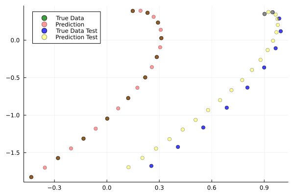
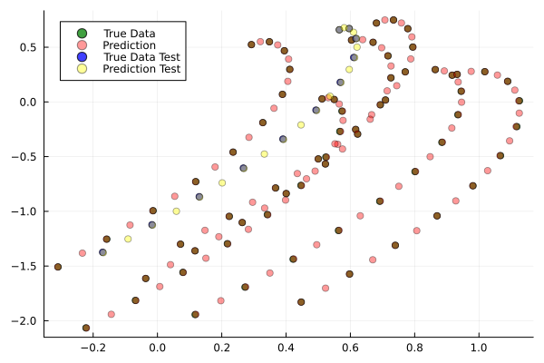
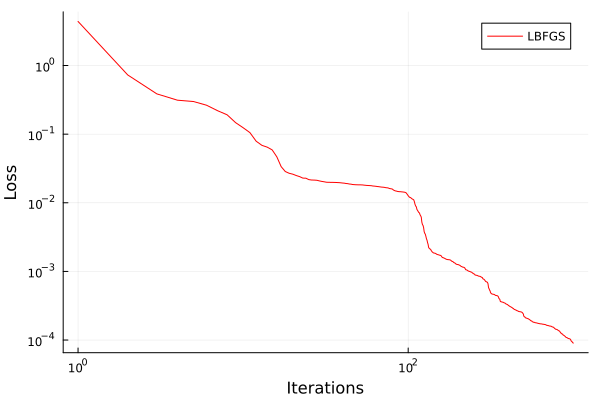
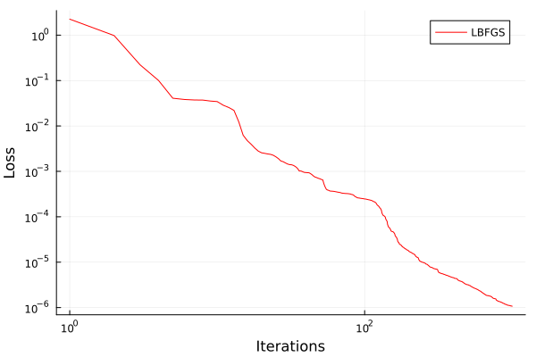

.. _sciml:

Scientific Machine Learning
===========================

.. questions::

   - What is the SciML Julia package and how to use it?
   - How can I mix physical pre-knowledge and data to solve modelling problems in Julia?

.. instructor-note::

   - 35 min teaching
   - 15 min exercises

.. callout::

   The code in this lession is written for Julia v1.11.3.

A modelling problem
-------------------

In this session we will have a look at a physical modelling problem
and investigate how Machine Learning can be used in combination with
classical modelling techniques.

Background on neural networks and scientific machine learning can be found
here :download:`download slides </slides/julia_kurs_notes.pdf>`.

Consider a spherical object moving in a viscous fluid under the influence
of drag along side other forces. We will consider this problem in 2 dimensions.
The code below is adapted from the
`Missing Physics example <https://docs.sciml.ai/Overview/stable/showcase/missing_physics/>`_
included in the SciML documentation.

.. code-block:: julia

   using LinearAlgebra, Statistics, Random
   using ComponentArrays, Lux, Zygote, Plots
   using OrdinaryDiffEq, ModelingToolkit, DataDrivenDiffEq, SciMLSensitivity, DataDrivenSparse
   using Optimization, OptimizationOptimisers, OptimizationOptimJL, LineSearches

   # random number generator
   rng = Random.default_rng()

   function dynamics!(du, u, p, t)
      m = 1.0
      g = 10.0
      # u[1] = x'
      # u[2] = x
      # u[3] = y'
      # u[4] = y

      # drag force, gravity and Lorentz force
      du[1] = -((u[1]^2 + u[3]^2)^0.5)*u[1] + 2*u[3]
      du[3] = -((u[1]^2 + u[3]^2)^0.5)*u[3] - g - 2*u[1]

      # reduce to 1st order ODE system
      du[2] = u[1]
      du[4] = u[3]
   end

   tspan = (0.0, 1.0)

   sc = 1.0
   deltat = 0.01

   u0 = sc * rand(4)
   inits_g = [rand(4) for ii in range(1,1)]

   prob = ODEProblem(dynamics!, u0, tspan)

   prbs = [ODEProblem(dynamics!, ui, tspan) for ui in inits_g]

   times = Vector(0:deltat:1.0)

   sols = [Array(solve(prb, Vern7(), abstol = 1e-12, reltol = 1e-12, saveat = deltat)) for prb in prbs]

   Xs = hcat(sols...)

   # for axis equal; aspect_ratio = :equal
   scatter(Xs[2,:], Xs[4,:], alpha = 0.75, color = :green, label = "True Data")

.. figure:: img/solutions_1.png
   :align: center

   Solution to an initial value problem.

The object experiences a drag force which scales as the speed squared,
and a constant gravitational pull. To illustrate the learning of
missing physics, we have added a Lorentz force experienced by a charged
particle under a contant magnetic field pointing in the z-direction.

.. code-block:: julia

      # m = 1.0
      # g = 10.0

      # drag force, gravity and Lorentz force
      du[1] = -((u[1]^2 + u[3]^2)^0.5)*u[1] + 2*u[3]
      du[3] = -((u[1]^2 + u[3]^2)^0.5)*u[3] - g - 2*u[1]

First consider an almost black box UDE (Universal Differential Equation) where we
model the whole right-hand side of the equation system by a neural network.
The model is helped by assumed prior knowledge of homogeneity, that is the forces
acting on the object only depend on its velocity, not its position.

.. code-block:: julia

   using LinearAlgebra, Statistics, Random
   using ComponentArrays, Lux, Zygote, Plots
   using OrdinaryDiffEq, ModelingToolkit, DataDrivenDiffEq, SciMLSensitivity, DataDrivenSparse
   using Optimization, OptimizationOptimisers, OptimizationOptimJL, LineSearches

   # random number generator
   rng = Random.default_rng()

   function dynamics!(du, u, p, t)
      m = 1.0
      g = 10.0
      # u[1] = x'
      # u[2] = x
      # u[3] = y'
      # u[4] = y

      # drag force, gravity and Lorentz force
      du[1] = -((u[1]^2 + u[3]^2)^0.5)*u[1] + 2*u[3]
      du[3] = -((u[1]^2 + u[3]^2)^0.5)*u[3] - g - 2*u[1]

      # reduce to 1st order ODE system
      du[2] = u[1]
      du[4] = u[3]
   end

   tspan = (0.0, 1.0)

   sc = 1.0
   deltat = 0.1

   u0 = sc * rand(4)
   inits_g = [rand(4) for ii in range(1,1)]

   prob = ODEProblem(dynamics!, u0, tspan)

   prbs = [ODEProblem(dynamics!, ui, tspan) for ui in inits_g]

   times = Vector(0:deltat:1.0)

   sols = [Array(solve(prb, Vern7(), abstol = 1e-12, reltol = 1e-12, saveat = deltat)) for prb in prbs]

   Xs = hcat(sols...)

   # for axis equal; aspect_ratio = :equal
   scatter(Xs[2,:], Xs[4,:], alpha = 0.75, color = :green, label = "True Data")
   # savefig("solutions_1.png")

   # define our activation function, radial basis function
   rbf(x) = exp.(-(x .^ 2))

   # the neural network
   const U = Lux.Chain(Lux.Dense(2, 5, rbf), Lux.Dense(5, 5, rbf), Lux.Dense(5, 5, rbf),
      Lux.Dense(5, 2))

   # Get the initial parameters and state variables of the model
   p, st = Lux.setup(rng, U)
   const _st = st

   function ude_dynamics!(du, u, p, t)
      û = U(u[[1,3],:], p, _st)[1]

      # black box
      du[1] = û[1]
      du[3] = û[2]

      # model with more structure
      ###du[1] = -((u[1]^2 + u[3]^2)^0.5)*u[1] + û[1]
      ###du[3] = -((u[1]^2 + u[3]^2)^0.5)*u[3] + û[2]

      # reduce to 1st order ODE system
      du[2] = u[1]
      du[4] = u[3]
   end

   nn_dynamics!(du, u, p, t) = ude_dynamics!(du, u, p, t)

   problems = [ODEProblem(nn_dynamics!, ui, tspan, p) for ui in inits_g]

   function predict(θ, inits = inits_g, T = times)
      _probs = [remake(problems[ii], u0 = inits[ii], tspan = (T[1], T[end]), p = θ) for ii in range(1,size(inits)[1])]
      allsols = [Array(solve(_prob, Vern7(), saveat = T, abstol = 1e-6, reltol = 1e-6, sensealg = QuadratureAdjoint(autojacvec = ReverseDiffVJP(true)))) for _prob in _probs]
      hcat(allsols...)
   end

   function loss(θ)
      X̂ = predict(θ)
      mean(abs2, Xs .- X̂)
   end

   losses = Float64[]

   callback = function (state, l)
      push!(losses, l)
      if length(losses) % 50 == 0
         println("Current loss after $(length(losses)) iterations: $(losses[end])")
      end
      return false
   end

   adtype = Optimization.AutoZygote()
   optf = Optimization.OptimizationFunction((x, p) -> loss(x), adtype)
   optprob = Optimization.OptimizationProblem(optf, ComponentVector{Float64}(p))

   # epochs = 250
   epochs = 1000

   res = Optimization.solve(
      optprob, LBFGS(linesearch = BackTracking()), callback = callback, maxiters = epochs)
   println("Final training loss after $(length(losses)) iterations: $(losses[end])")

   p_trained = res.u

   plot(1:length(losses), losses[1:end], yaxis = :log10, xaxis = :log10,
      xlabel = "Iterations", ylabel = "Loss", label = "LBFGS", color = :red)

   ts = first(times):(mean(diff(times)) / 2):last(times)
   X̂ = predict(p_trained, inits_g, ts)
   scatter(Xs[2,:], Xs[4,:], alpha = 0.75, color = :green, label = "True Data")
   scatter!(X̂[2,:], X̂[4,:], alpha = 0.4, color = :red, label = "Prediction")

   u_test = rand(4)
   X̂_test = predict(p_trained, [u_test], ts)
   prob_test = ODEProblem(dynamics!, u_test, tspan)
   solution_test = solve(prob_test, Vern7(), abstol = 1e-12, reltol = 1e-12, saveat = deltat)
   Xs_test = Array(solution_test)
   scatter!(Xs_test[2,:], Xs_test[4,:], alpha = 0.75, color = :blue, label = "True Data Test")
   #scatter(Xs_test[2,:], Xs_test[4,:], alpha = 0.75, color = :blue, label = "True Data Test")
   scatter!(X̂_test[2,:], X̂_test[4,:], alpha = 0.4, color = :yellow, label = "Prediction Test")
   # savefig("solutions_2.png")

At the end of the script, we plot the true data and model prediction on the
trajectory that was used as training data as well as a test trajectory with
random initial values.

   One training and one test trajectory with their corresponding predictions.

The predictions on the training trajectory are accurate but the predictions
on the test trajectory are not very good. This is not too unexpected since we
are only training the model on a single inital condition. Let's see what happens
when we train the model on trajectories from 6 randomly generated initial conditions
instead.

.. code-block:: julia

   # inits_g = [rand(4) for ii in range(1,1)]
   inits_g = [rand(4) for ii in range(1,6)]

   Training on 6 trajectories. Prediction on test trajectory is quite
   good in this case.

It takes the black box UDE about 1000 epochs to get a good result.

   Training loss on the black box UDE model.

Now consider the case where, as an example, the drag force is known but not
the rest of the dynamics. This means that the neural network has to learn
for intance the Lorentz force from data. A model that uses partial pre-knowledge
and learns the rest from data is called a hybrid model. To implement this,
we make the following change in the function defining the UDE dynamics:
explicitly encode the drag force and let the neural network take care of the rest,
that is the other terms on the right-hand side of the system of equations.

.. code-block:: julia

   function ude_dynamics!(du, u, p, t)
      û = U(u[[1,3],:], p, _st)[1]

      # black box
      ###du[1] = û[1]
      ###du[3] = û[2]

      # model with more structure
      du[1] = -((u[1]^2 + u[3]^2)^0.5)*u[1] + û[1]
      du[3] = -((u[1]^2 + u[3]^2)^0.5)*u[3] + û[2]

      du[2] = u[1]
      du[4] = u[3]
   end

In this case we get similar results but much quicker.

   Training loss on the hybrid model.

.. todo:: Not assuming homogeneity

   In the dynamics example above, what happens if you do not assume homogeneity? In other words,
   if the forces acting on the object are allowed to depend both the object's velocity and position,
   as would be the case if for example the magetic field was non-homogeneous. Try running the code
   under such weaker assumptions.

   .. solution:: Modifications

      You can change the definition of the UDE dynamics by letting the neural network that models
      the dynamics depend on both position and velocity:

      .. code-block:: julia

         function ude_dynamics!(du, u, p, t)
            # û = U(u[[1,3],:], p, _st)[1]
            û = U(u, p, _st)[1] # U depends on the whole u

            # black box
            du[1] = û[1]
            du[3] = û[2]

            # model with more structure
            ###du[1] = -((u[1]^2 + u[3]^2)^0.5)*u[1] + û[1]
            ###du[3] = -((u[1]^2 + u[3]^2)^0.5)*u[3] + û[2]

            # reduce to 1st order ODE system
            du[2] = u[1]
            du[4] = u[3]
         end

      You also have to make sure that the neural network has 4 input nodes rather than just 2:

      .. code-block:: julia

         #const U = Lux.Chain(Lux.Dense(2, 5, rbf), Lux.Dense(5, 5, rbf), Lux.Dense(5, 5, rbf),
         #   Lux.Dense(5, 2))
         const U = Lux.Chain(Lux.Dense(4, 5, rbf), Lux.Dense(5, 5, rbf), Lux.Dense(5, 5, rbf),
            Lux.Dense(5, 2))

      Typically you need more data to get similar results compared to the case where we assume
      homogeneity.

      If you get issues with renaming :math:`U` since you already ran the code with the orignal definition,
      you can restart the REPL or introduce another neural network :math:`V` and replace :math:`U` where needed.

.. todo:: The neural network

   Experiment with other architecture of the neural network in the above example. How small
   (in terms of number of parameters) can it be and still perform well? Is the convergence rate slower
   or faster when the number of parameter increases or decreases? You can also try other
   activation functions and see how the model performs (tanh, ReLU, GELU, etc.).